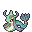
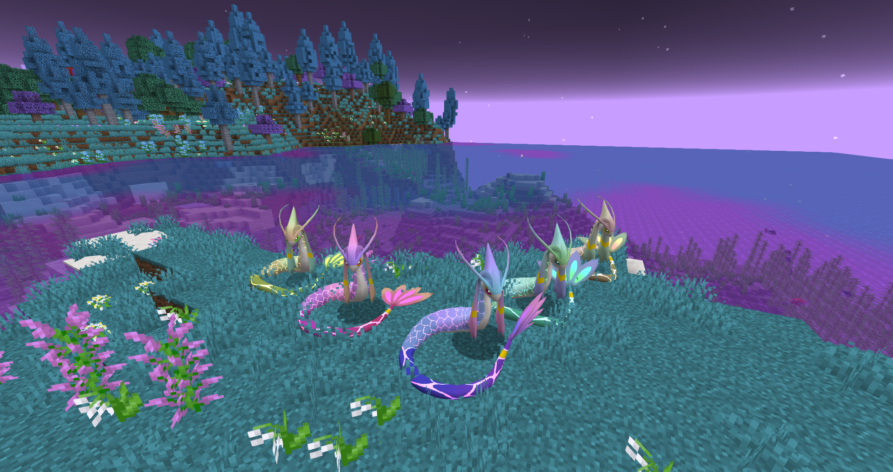

# 🥈 Milotic Primordial

## Información

**Milotic Primordial** es una Skin exclusiva del servidor introducida en la [Temporada Mística (1)](./).

|                     **Artwork** |                                                                                     |
| ------------------------------: | -------------------------------------------------------------------------------------------------------------------------------------- |
|                      **Sprite** |                                                           |                                                                                                             |
|                      Creado por | FuriadaNoite, BonMurci y OdyZam                                                                                                               |

La creación de esta skin se basa en la energía primordial de la creación, haciendo referencia tanto al tema místico como a el lore de la temporada actual.

### Comentario del desarrollador
 Esta skin puede cambiar de estilo usando el comando [/estilos](../../funciones/estilos.md).

## Formas

|  Nível |  Forma |                                            Sprite                                           |
| :----: | :----: | :-----------------------------------------------------------------------------------------: |
| **1** | Primordial Oceano |                |
| **25** | Primordial Marino |    |
| **53** | Primordial Coral |  |
| **85** | Primordial Arrecife |  |
| **96** | Primordial Esmeralda |  |

## Obtención

Esta skin se puede obtener en el nivel 1 del pase gratuito de la temporada 1 y sus otros estilos se obtiene en otros niveles del pase como se muestra arriba.
