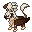

# 🥈 Silvally Grifo

## Información

**Silvally Grifo** es una Skin exclusiva del servidor introducida en la [Temporada Mística (1)](./).

|                     **Artwork** |                                                                                     |
| ------------------------------: | -------------------------------------------------------------------------------------------------------------------------------------- |
|                      **Sprite** |                                                           |                                                                                                             |
|                      Creado por | FuriadaNoite y BonMurci                                                                                                                |

### Comentario del desarrollador
La creación de este skin se basó en las criaturas mitológicas grifo, y decidimos que silvally era la mejor opción debido a su capacidad de cambiar de tipo además de su forma física.

 Esta skin, al igual que la versión original, puede cambiar de forma usando sus [Discos](https://www.wikidex.net/wiki/Disco).

## Obtención

Esta skin se puede obtener en el nivel 100 del pase gratuito de la temporada 1.
