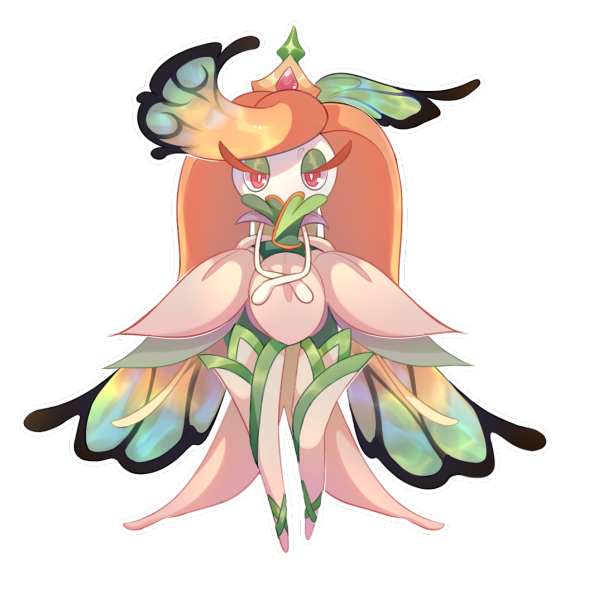
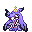

# 🥇 Tsareena Estacional

## Información

**Tsareena Estacional** es una Skin exclusiva del servidor introducida en la [Temporada Mística (1)](./).

|                     **Artwork** |                                                                                     |
| ------------------------------: | -------------------------------------------------------------------------------------------------------------------------------------- |
|                      **Sprite** |                                                           |                                                                                                             |
|                      Creado por | FuriadaNoite y BonMurci                                                                                                                |

La creación de esta skin se basa en hadas estacionales, haciendo referencia tanto al tema místico como a los nuevos biomas.

## Formas

|  Nível |  Forma |                                            Sprite                                           |
| :----: | :----: | :-----------------------------------------------------------------------------------------: |
| **1** | Estacional Otoño |                |
| **25** | Estacional Primavera |    |
| **49** | Estacional Verano |  |
| **75** | Estacional Invierno |  |
| **99** | Estacional Blossom |  |

## Obtención

Esta skin se puede obtener en el nivel 1 del pase de paga y sus otros estilos se obtiene en otros niveles del pase como se muestra arriba.
