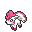
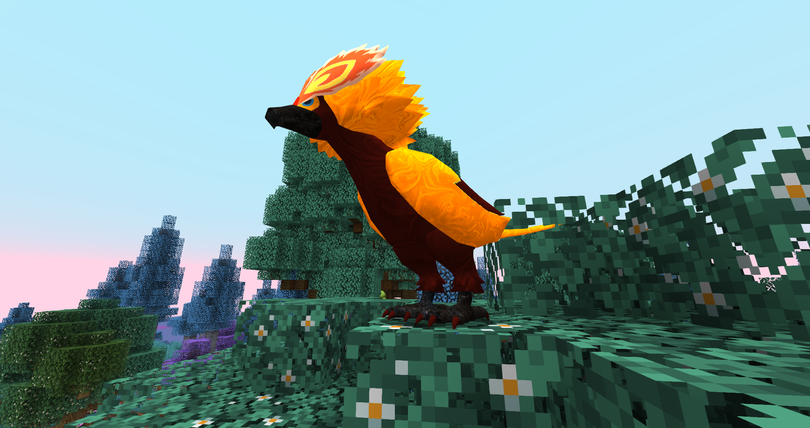

# 🥇 Vulpix y Ninetales Espiritu Lunar
## Información

**Vulpix Espiritu Lunar** y **Ninetales Espiritu Lunar** son Skins exclusivas del servidor introducida en la [Temporada Mística (1)](./).

|                     **Artwork** |                                                                                     |
| ------------------------------: | -------------------------------------------------------------------------------------------------------------------------------------- |
|                  **Sprite** |   [Sprite de Ninetales Espiritu Lunar](../../images/pokemon/temporada-1/EspirituLunar2-sprite.png)                                                          |                                                                                                             |
|                      Creado por | FuriadaNoite y BonMurci                                                                                                                |

La creación de esta skin hace referencia a la criatura mitológica Fénix y también al lore de la temporada, con el nacimiento de un nuevo mundo.

## Obtención

Esta skin se puede obtener en el nivel 70 del pase gratuito.
