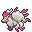
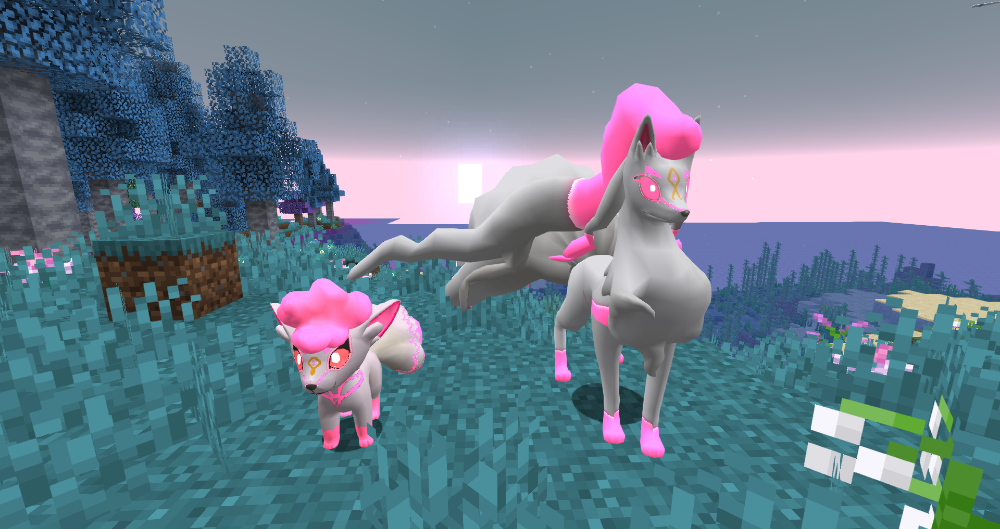

# 🥇 Vulpix y Ninetales Espiritu Lunar
## Información

**Vulpix Espiritu Lunar** y **Ninetales Espiritu Lunar** son Skins exclusivas del servidor introducida en la [Temporada Mística (1)](./).

|                     **Artwork** |                                                                                     |
| ------------------------------: | -------------------------------------------------------------------------------------------------------------------------------------- |
|                  **Sprite** |                                                            |                                                                                                             |
|                      Creado por | FuriadaNoite y BonMurci                                                                                                                |

### Comentario del desarrollador
La creación de este skin hace referencia a la criatura mitológica Kitsune además de misticismos relacionados con la luna.

## Obtención

Esta skin se puede obtener en el nivel 50 del [pase premium](https://tienda.mundopixelnet.com/category/servidor-escarlata-3) de la temporada 1.
