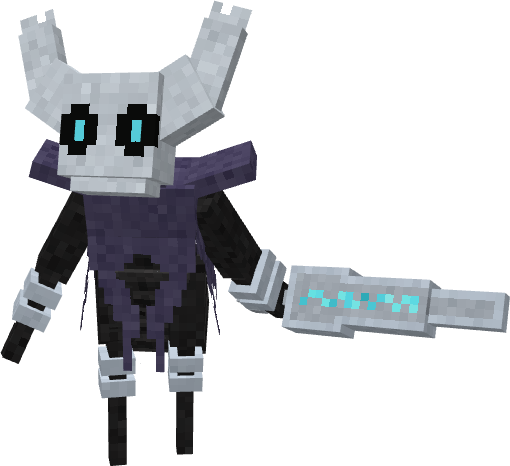

# 🐛 Línea Evolutiva: Glowmite (Documentación Completa)

---

## 1. Glowmite (Nº 2001) - La Cría

> **Lore:** La primera y más elemental de estas manifestaciones, se cree que es una fase larval o una forma rudimentaria del Vacío. Su brillo tenue en la oscuridad, lejos de ser una guía, parece ser una pulsación de su propia esencia, una llamada silenciosa desde las profundidades.

### ℹ️ Resumen y Estadísticas

| Detalle | Información | Stat (EV) | Valor Base |
| :--- | :--- | :--- | :--- |
| **Tipo Primario** | Bicho (Bug) | HP (0) | 45 |
| **Evoluciona a** | Chryseil (Nivel 12) | Ataque (1) | 30 |
| **Grupo Huevo** | Bicho | Defensa (0) | 37 |
| **Habilidades** | Shield Dust, Unnerve. | Sp. Atk (1) | 30 |
| **Habilidad Oculta** | Run Away | Sp. Def (0) | 15 |
| **Total Stats** | 202 | Velocidad (0) | 45 |

### 📚 Movimientos Aprendidos

| Tipo | Nivel / Fuente | Movimiento | Tipo | Nivel / Fuente | Movimiento |
| :--- | :--- | :--- | :--- | :--- | :--- |
| **Nivel** | 1 | Astonish | **Nivel** | 5 | Leech Life |
| **Nivel** | 1 | Tackle | **Nivel** | 7 | Harden |
| **Nivel** | 2 | String Shot | **Nivel** | 10 | Bug Bite |
| **MT/Tutor** | MT | Snore | **MT/Tutor** | MT | Electro Web |
| **MT/Tutor** | MT | Bug Bite | **MT/Tutor** | MT | Tera Blast |
| **MT/Tutor** | Tutor | Electro Web | **MT/Tutor** | Tutor | Hex |

---

## 2. Chryseil (Nº 2002) - La Crisálida

> **Lore:** Esta forma no es una solidificación pasiva. Es una crisálida activa, un capullo donde ocurre un proceso imposible: la criatura fusiona la seda primigenia recolectada de la oscuridad con la esencia pura del Vacío del Abismo. El resultado es una armadura natural, una 'Seda-Quitina' forjada de hebra y nada, que sirve como protección perfecta mientras evoluciona.

### ℹ️ Resumen y Estadísticas

| Detalle | Información | Stat (EV) | Valor Base |
| :--- | :--- | :--- | :--- |
| **Tipo Primario** | Bicho (Bug) | HP (0) | 50 |
| **Evoluciona a** | Silkorn (Hembra, Nv 32) / Veskorn (Macho, Nv 32) | Ataque (0) | 35 |
| **Grupo Huevo** | Bicho | **Defensa (2)** | 45 |
| **Habilidad** | Shed Skin. | Sp. Atk (0) | 30 |
| **Habilidad Oculta** | Rock Head | Sp. Def (0) | 20 |
| **Total Stats** | 220 | Velocidad (0) | 40 |

### 📚 Movimientos Aprendidos

| Tipo | Nivel / Fuente | Movimiento | Tipo | Nivel / Fuente | Movimiento |
| :--- | :--- | :--- | :--- | :--- | :--- |
| **Nivel** | 15 | Iron Defense | **Nivel** | 27 | Counter |
| **Nivel** | 18 | Body Slam | **Nivel** | 30 | U-Turn |
| **Nivel** | 25 | Confuse Ray | **MT/Tutor** | MT | Toxic |
| **MT/Tutor** | MT | Swords Dance | **MT/Tutor** | MT | Earthquake |
| **MT/Tutor** | MT | Pin Missile | **MT/Tutor** | MT | Earth Power |
| **MT/Tutor** | MT | Protect | **MT/Tutor** | MT | Reflect |
| **MT/Tutor** | MT | Light Screen | **MT/Tutor** | MT | Hex |
| *(Hereda todos los movimientos de Glowmite y MTs/Tutor compartidos)* |

---

## 3. Veskorn (Nº 2003) - Forma Macho (Especialista)

> **Lore:** Este ser es un receptáculo de pura sombra, un cascarón silencioso que sacrifica su tamaño por un poder espectral. Su armadura de Seda-Quitina se oscurece, volviéndose quebradiza pero ligera. Armado con un 'aguijón' afilado—una extensión de su propia voluntad solidificada—, Veskorn es un cazador implacable que encarna la tenacidad y el silencio del Abismo. Se mueve sin sonido, un guardián de secretos oscuros.

### ℹ️ Resumen y Estadísticas

| Detalle | Información | Stat (EV) | Valor Base |
| :--- | :--- | :--- | :--- |
| **Tipos** | Bicho / Fantasma | HP (0) | 90 |
| **Especialidad** | Atacante Especial | Ataque (0) | 75 |
| **Grupo Huevo** | Bicho, Humanoide | Defensa (0) | 90 |
| **Habilidades** | Pressure, Swarm. | **Sp. Atk (2)** | **125** |
| **Habilidad Oculta** | Mold Breaker | Sp. Def (0) | 70 |
| **Total Stats** | 540 | Velocidad (0) | 90 |

### 👻 Movimientos Aprendidos

#### Movimientos por Nivel (Destacados)

| Nivel | Movimiento | Nivel | Movimiento |
| :--- | :--- | :--- | :--- |
| 32 | Ominous Wind | 56 | Hex |
| 44 | Destiny Bond | 60 | Psychic |
| 48 | Shadow Ball | 68 | Calm Mind |
| 52 | Dark Pulse | 72 | Bug Buzz |

#### Movimientos por Grupo Huevo

| Movimiento | Tipo | Movimiento | Tipo |
| :--- | :--- | :--- | :--- |
| Shadow Sneak | Fantasma | Sacred Sword | Lucha |
| Will-O-Wisp | Fuego | Night Shade | Fantasma |
| Memento | Siniestro | | |

#### Movimientos por MT y Tutor (Selección)

| Fuente | Movimiento | Fuente | Movimiento |
| :--- | :--- | :--- | :--- |
| MT | Rage Powder | MT | Shadow Claw |
| MT | Energy Ball | MT | Dazzling Gleam |
| MT | Sticky Web | MT | Grudge |
| Tutor | Pain Split | Tutor | Ally Switch |

---

## 4. Silkorn (Nº 2004) - Forma Hembra (Física/Veloz)

> **Lore:** Esta forma es la encarnación de la destreza y la gracia letal. Más alta y esbelta, Silkorn ha refinado la fusión, utilizando el Vacío solo como núcleo de poder mientras teje la Seda en una armadura ligera y flexible que permite una agilidad acrobática. Armada con una 'aguja' quitinosa, Silkorn no solo usa la seda; la comanda, lanzando hilos para moverse y atacar. No es un espectro silencioso, sino una bailarina orgullosa, una protectora de su territorio que danza en la oscuridad.

### ℹ️ Resumen y Estadísticas

| Detalle | Información | Stat (EV) | Valor Base |
| :--- | :--- | :--- | :--- |
| **Tipos** | Bicho / Lucha | HP (0) | 80 |
| **Especialidad** | Atacante Físico y Velocidad | **Ataque (2)** | **125** |
| **Grupo Huevo** | Bicho, Humanoide | Defensa (0) | 80 |
| **Habilidades** | Sharpness, Swarm. | Sp. Atk (0) | 90 |
| **Habilidad Oculta** | Speed Boost | Sp. Def (0) | 65 |
| **Total Stats** | 541 | **Velocidad (0)** | **101** |

### 🥋 Movimientos Aprendidos

#### Movimientos por Nivel (Destacados)

| Nivel | Movimiento | Nivel | Movimiento |
| :--- | :--- | :--- | :--- |
| 32 | Pin Missile | 56 | Slash |
| 36 | Bulk Up | 64 | Night Slash |
| 40 | X-Scissor | 68 | Fury Cutter |
| 48 | Cross Poison | 72 | Close Combat |

#### Movimientos por Grupo Huevo

| Movimiento | Tipo | Movimiento | Tipo |
| :--- | :--- | :--- | :--- |
| Shadow Sneak | Fantasma | Sacred Sword | Lucha |
| Knock Off | Siniestro | Bug Buzz | Bicho |
| Shadow Ball | Fantasma | Will-O-Wisp | Fuego |

#### Movimientos por MT y Tutor (Selección)

| Fuente | Movimiento | Fuente | Movimiento |
| :--- | :--- | :--- | :--- |
| MT | Knock Off | MT | U-Turn |
| MT | Mega Horn | MT | First Impression |
| Tutor | Dual Chop | Tutor | Iron Head |
| Tutor | Superpower | Tutor | Zen Headbutt |
