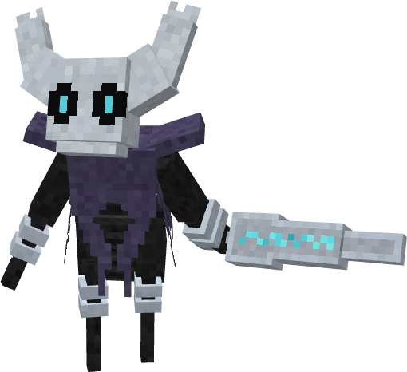
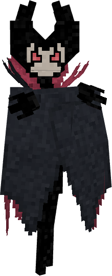
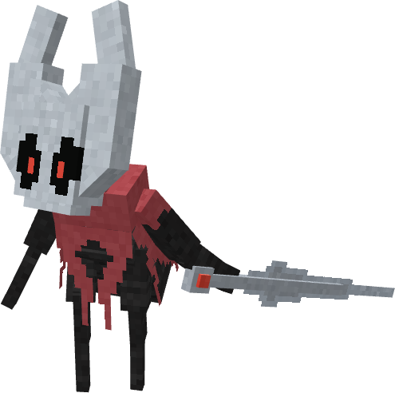

# 🐛 Línea Evolutiva: Veskorn y Silkorn

**Glowmite** → **Chryseil** → **Veskorn** (macho) / **Silkorn** (hembra)

**Ir a:** [Glowmite](#glowmite) · [Chryseil](#chryseil) · [Veskorn](#veskorn) · [Silkorn](#silkorn)

---

## 1. Glowmite (Nº 2001)

### Información

**Glowmite** es un Pokémon de tipo [bicho](https://www.wikidex.net/wiki/Tipo_bicho)/[siniestro](https://www.wikidex.net/wiki/Tipo_siniestro) introducido en la **Temporada Inicial**. Es la fase larval de la línea evolutiva.

| **Artwork** |  |
| :---: | :--- |
| **Tipos** |   |
| **Habilidades** | [Swarm](https://www.wikidex.net/wiki/Enjambre) [Unburden](https://www.wikidex.net/wiki/Liviano) |
| **Hab. oculta** | [Steadfast](https://www.wikidex.net/wiki/Impasible) |
| **Grupo Huevo** | [Bicho](https://www.wikidex.net/wiki/Grupo_bicho) |
| **Evoluciona a** | [Chryseil](#chryseil) |
| **Creado por** | xFuriadaNoitex |

### Descripción (Lore)
**Glowmite:** La primera y más elemental de estas manifestaciones, se cree que es una fase larval o una forma rudimentaria del Vacío. Su brillo tenue en la oscuridad, lejos de ser una guía, parece ser una pulsación de su propia esencia, una llamada silenciosa desde las profundidades.

### Características base

Las [características base](https://www.wikidex.net/wiki/Caracter%C3%ADsticas) de Glowmite son las siguientes:

| Estadística | Distribución |
| :--- | :---: |
| **PS** | **30** `██░░░░░░░░` |
| **Ataque** | **25** `██░░░░░░░░` |
| **Defensa** | **30** `██░░░░░░░░` |
| **At. Esp** | **40** `███░░░░░░░` |
| **Def. Esp** | **25** `██░░░░░░░░` |
| **Velocidad** | **50** `████░░░░░░` |
| **TOTAL** | **200** |

### Movimientos



| Nivel | Movimiento | Tipo |
| :---: | :---: | :---: |
| 1 | [Astonish](https://www.wikidex.net/wiki/Impresionar) |  |
| 1 | [Tackle](https://www.wikidex.net/wiki/Placaje) |  |
| 2 | [String Shot](https://www.wikidex.net/wiki/Disparo_demora) |  |
| 5 | [Leech Life](https://www.wikidex.net/wiki/Chupavidas) |  |
| 7 | [Harden](https://www.wikidex.net/wiki/Fortaleza) |  |
| 10 | [Bug Bite](https://www.wikidex.net/wiki/Picadura) |  |



| Movimiento | Tipo | Movimiento | Tipo |
| :---: | :---: | :---: | :---: |
| [Snore](https://www.wikidex.net/wiki/Ronquido) |  | [Electroweb](https://www.wikidex.net/wiki/Electrotela) |  |
| [Bug Bite](https://www.wikidex.net/wiki/Picadura) |  | [Tera Blast](https://www.wikidex.net/wiki/Teraexplosi%C3%B3n) |  |
| [Hex](https://www.wikidex.net/wiki/Infortunio) |  | | |



---

## 2. Chryseil (Nº 2002)

### Información

**Chryseil** es un Pokémon de tipo [bicho](https://www.wikidex.net/wiki/Tipo_bicho)/[siniestro](https://www.wikidex.net/wiki/Tipo_siniestro) introducido en la **Temporada Inicial**. Es la fase crisálida y de transición.

| **Artwork** |  |
| :---: | :--- |
| **Tipos** |   |
| **Habilidades** | [Swarm](https://www.wikidex.net/wiki/Enjambre) [Unburden](https://www.wikidex.net/wiki/Liviano) |
| **Hab. oculta** | [Steadfast](https://www.wikidex.net/wiki/Impasible) |
| **Grupo Huevo** | [Bicho](https://www.wikidex.net/wiki/Grupo_bicho) |
| **Evoluciona de** | [Glowmite](#glowmite) |
| **Evoluciona a** | [Veskorn](#veskorn) (macho) [Silkorn](#silkorn) (hembra) |
| **Creado por** | xFuriadaNoitex |

### Descripción (Lore)
**Chryseil:** Esta forma no es una solidificación pasiva. Es una crisálida activa, un capullo donde ocurre un proceso imposible: la criatura fusiona la seda primigenia recolectada de la oscuridad con la esencia pura del Vacío del Abismo. El resultado es una armadura natural, una 'Seda-Quitina' forjada de hebra y nada, que sirve como protección perfecta mientras evoluciona.

### Características base

Las [características base](https://www.wikidex.net/wiki/Caracter%C3%ADsticas) de Chryseil son las siguientes:

| Estadística | Distribución |
| :--- | :---: |
| **PS** | **65** `█████░░░░░` |
| **Ataque** | **25** `██░░░░░░░░` |
| **Defensa** | **50** `████░░░░░░` |
| **At. Esp** | **55** `████░░░░░░` |
| **Def. Esp** | **60** `█████░░░░░` |
| **Velocidad** | **30** `██░░░░░░░░` |
| **TOTAL** | **285** |

### Movimientos



| Nivel | Movimiento | Tipo |
| :---: | :---: | :---: |
| 15 | [Iron Defense](https://www.wikidex.net/wiki/Defensa_f%C3%A9rrea) |  |
| 18 | [Body Slam](https://www.wikidex.net/wiki/Golpe_cuerpo) |  |
| 25 | [Confuse Ray](https://www.wikidex.net/wiki/Rayo_confuso) |  |
| 27 | [Counter](https://www.wikidex.net/wiki/Contraataque) |  |
| 30 | [U-turn](https://www.wikidex.net/wiki/Ida_y_vuelta) |  |



| Movimiento | Tipo | Movimiento | Tipo | Movimiento | Tipo |
| :---: | :---: | :---: | :---: | :---: | :---: |
| [Swords Dance](https://www.wikidex.net/wiki/Danza_espada) |  | [Toxic](https://www.wikidex.net/wiki/T%C3%B3xico) |  | [Pin Missile](https://www.wikidex.net/wiki/Pin_misil) |  |
| [Earthquake](https://www.wikidex.net/wiki/Terremoto) |  | [Earth Power](https://www.wikidex.net/wiki/Tierra_viva) |  | [Protect](https://www.wikidex.net/wiki/Protecci%C3%B3n) |  |
| [Reflect](https://www.wikidex.net/wiki/Reflejo) |  | [Light Screen](https://www.wikidex.net/wiki/Pantalla_de_luz) |  | [Hex](https://www.wikidex.net/wiki/Infortunio) |  |



---

## 3. Veskorn (Nº 2003) - Forma Macho

### Información

**Veskorn** es un Pokémon de tipo [siniestro](https://www.wikidex.net/wiki/Tipo_siniestro)/[fantasma](https://www.wikidex.net/wiki/Tipo_fantasma) introducido en la **Temporada Inicial**. Es la bifurcación masculina, especializada en Ataque Especial.

| **Artwork** |  |
| :---: | :--- |
| **Tipos** |   |
| **Habilidades** | [Competitive](https://www.wikidex.net/wiki/Competitivo) [Unburden](https://www.wikidex.net/wiki/Liviano) |
| **Hab. oculta** | [Mold Breaker](https://www.wikidex.net/wiki/Rompemoldes) |
| **Grupos Huevo** | [Bicho](https://www.wikidex.net/wiki/Grupo_bicho), [Humanoide](https://www.wikidex.net/wiki/Grupo_humanoide) |
| **Evoluciona de** | [Chryseil](#chryseil) |
| **Creado por** | xFuriadaNoitex |

<strong>Ver Aspecto Alternativo: Forma Grimm</strong>

 

### Forma Grimm

*Aspecto especial alternativo inspirado en la Forma Grimm.*

 

### Descripción (Lore)
**Veskorn:** Este ser es un receptáculo de pura sombra, un cascarón silencioso que sacrifica su tamaño por un poder espectral. Su armadura de Seda-Quitina se oscurece, volviéndose quebradiza pero ligera. Armado con un 'aguijón' afilado (una extensión de su propia voluntad solidificada), Veskorn es un cazador implacable que encarna la tenacidad y el silencio del Abismo. Se mueve sin sonido, un guardián de secretos oscuros.

### Características base

Las [características base](https://www.wikidex.net/wiki/Caracter%C3%ADsticas) de Veskorn son las siguientes:

| Estadística | Distribución |
| :--- | :---: |
| **PS** | **70** `██████░░░░` |
| **Ataque** | **60** `█████░░░░░` |
| **Defensa** | **85** `███████░░░` |
| **At. Esp** | **125** `██████████` |
| **Def. Esp** | **85** `███████░░░` |
| **Velocidad** | **95** `████████░░` |
| **TOTAL** | **520** |

### Movimientos



| Nivel | Movimiento | Tipo | Nivel | Movimiento | Tipo |
| :---: | :---: | :---: | :---: | :---: | :---: |
| 32 | [Ominous Wind](https://www.wikidex.net/wiki/Viento_aciago) |  | 52 | [Dark Pulse](https://www.wikidex.net/wiki/Pulso_umbr%C3%ADo) |  |
| 36 | [Giga Drain](https://www.wikidex.net/wiki/Giga_drenado) |  | 56 | [Hex](https://www.wikidex.net/wiki/Infortunio) |  |
| 40 | [Pollen Puff](https://www.wikidex.net/wiki/Encuesta_polen) |  | 60 | [Psychic](https://www.wikidex.net/wiki/Ps%C3%ADquico) |  |
| 44 | [Destiny Bond](https://www.wikidex.net/wiki/Mismo_destino) |  | 68 | [Calm Mind](https://www.wikidex.net/wiki/Paz_mental) |  |
| 48 | [Shadow Ball](https://www.wikidex.net/wiki/Bola_sombra) |  | 72 | [Bug Buzz](https://www.wikidex.net/wiki/Zumbido) |  |



| Movimiento | Tipo | Movimiento | Tipo |
| :---: | :---: | :---: | :---: |
| [Shadow Sneak](https://www.wikidex.net/wiki/Sombra_vil) |  | [Sacred Sword](https://www.wikidex.net/wiki/Espada_santa) |  |
| [Will-O-Wisp](https://www.wikidex.net/wiki/Fuego_fatuo) |  | [Night Shade](https://www.wikidex.net/wiki/Tinieblas) |  |
| [Memento](https://www.wikidex.net/wiki/Legado) |  | | |



| Movimiento | Tipo | Movimiento | Tipo | Movimiento | Tipo |
| :---: | :---: | :---: | :---: | :---: | :---: |
| [Rage Powder](https://www.wikidex.net/wiki/Polvo_ira) |  | [Sticky Web](https://www.wikidex.net/wiki/Red_pegajosa) |  | [Energy Ball](https://www.wikidex.net/wiki/Energibola) |  |
| [Shadow Claw](https://www.wikidex.net/wiki/Garra_umbr%C3%ADa) |  | [Dazzling Gleam](https://www.wikidex.net/wiki/Brillo_m%C3%A1gico) |  | [Mystical Fire](https://www.wikidex.net/wiki/Llama_m%C3%ADstica) |  |
| [Pain Split](https://www.wikidex.net/wiki/Divide_dolor) |  | [Trick](https://www.wikidex.net/wiki/Truco) |  | [Ally Switch](https://www.wikidex.net/wiki/Cambio_de_banda) |  |



---

## 4. Silkorn (Nº 2004) - Forma Hembra

### Información

**Silkorn** es un Pokémon de tipo [siniestro](https://www.wikidex.net/wiki/Tipo_siniestro)/[lucha](https://www.wikidex.net/wiki/Tipo_lucha) introducido en la **Temporada Inicial**. Es la bifurcación femenina, especializada en Ataque Físico.

| **Artwork** |  |
| :---: | :--- |
| **Tipos** |   |
| **Habilidades** | [Defiant](https://www.wikidex.net/wiki/Tenacidad) [Unburden](https://www.wikidex.net/wiki/Liviano) |
| **Hab. oculta** | [Sharpness](https://www.wikidex.net/wiki/Cortante) |
| **Grupos Huevo** | [Bicho](https://www.wikidex.net/wiki/Grupo_bicho), [Humanoide](https://www.wikidex.net/wiki/Grupo_humanoide) |
| **Evoluciona de** | [Chryseil](#chryseil) |
| **Creado por** | xFuriadaNoitex |

### Descripción (Lore)
**Silkorn:** Esta forma es la encarnación de la destreza y la gracia letal. Más alta y esbelta, Silkorn ha refinado la fusión, utilizando el Vacío solo como núcleo de poder mientras teje la Seda en una armadura ligera y flexible que permite una agilidad acrobática. Armada con una 'aguja' quitinosa, Silkorn no solo usa la seda; la comanda, lanzando hilos para moverse y atacar. No es un espectro silencioso, sino una bailarina orgullosa, una protectora de su territorio que danza en la oscuridad.

### Características base

Las [características base](https://www.wikidex.net/wiki/Caracter%C3%ADsticas) de Silkorn son las siguientes:

| Estadística | Distribución |
| :--- | :---: |
| **PS** | **70** `██████░░░░` |
| **Ataque** | **125** `██████████` |
| **Defensa** | **60** `█████░░░░░` |
| **At. Esp** | **80** `██████░░░░` |
| **Def. Esp** | **75** `██████░░░░` |
| **Velocidad** | **110** `█████████░` |
| **TOTAL** | **520** |

### Movimientos



| Nivel | Movimiento | Tipo | Nivel | Movimiento | Tipo |
| :---: | :---: | :---: | :---: | :---: | :---: |
| 32 | [Pin Missile](https://www.wikidex.net/wiki/Pin_misil) |  | 56 | [Slash](https://www.wikidex.net/wiki/Cuchillada) |  |
| 36 | [Bulk Up](https://www.wikidex.net/wiki/Corpulencia) |  | 64 | [Night Slash](https://www.wikidex.net/wiki/Tajo_noche) |  |
| 40 | [X-Scissor](https://www.wikidex.net/wiki/Tijera_X) |  | 68 | [Fury Cutter](https://www.wikidex.net/wiki/Corte_furia) |  |
| 44 | [Aerial Ace](https://www.wikidex.net/wiki/Golpe_a%C3%A9reo) |  | 72 | [Close Combat](https://www.wikidex.net/wiki/A_bocajarro) |  |
| 48 | [Cross Poison](https://www.wikidex.net/wiki/Veneno_X) |  | | | |
| 52 | [Tidy Up](https://www.wikidex.net/wiki/Limpieza) |  | | | |



| Movimiento | Tipo | Movimiento | Tipo |
| :---: | :---: | :---: | :---: |
| [Shadow Sneak](https://www.wikidex.net/wiki/Sombra_vil) |  | [Sacred Sword](https://www.wikidex.net/wiki/Espada_santa) |  |
| [Knock Off](https://www.wikidex.net/wiki/Desarme) |  | [Bug Buzz](https://www.wikidex.net/wiki/Zumbido) |  |
| [Shadow Ball](https://www.wikidex.net/wiki/Bola_sombra) |  | [Will-O-Wisp](https://www.wikidex.net/wiki/Fuego_fatuo) |  |
| [Night Shade](https://www.wikidex.net/wiki/Tinieblas) |  | | |



| Movimiento | Tipo | Movimiento | Tipo | Movimiento | Tipo |
| :---: | :---: | :---: | :---: | :---: | :---: |
| [Knock Off](https://www.wikidex.net/wiki/Desarme) |  | [First Impression](https://www.wikidex.net/wiki/Escaramuza) |  | [Megahorn](https://www.wikidex.net/wiki/Megacuerno) |  |
| [Drill Run](https://www.wikidex.net/wiki/Taladradora) |  | [Superpower](https://www.wikidex.net/wiki/Fuerza_bruta) |  | [Zen Headbutt](https://www.wikidex.net/wiki/Cabezazo_zen) |  |
| [Iron Head](https://www.wikidex.net/wiki/Cabeza_de_hierro) |  | [Throat Chop](https://www.wikidex.net/wiki/Garganta_imp%C3%ADa) |  | [Laser Focus](https://www.wikidex.net/wiki/Enfoque) |  |


