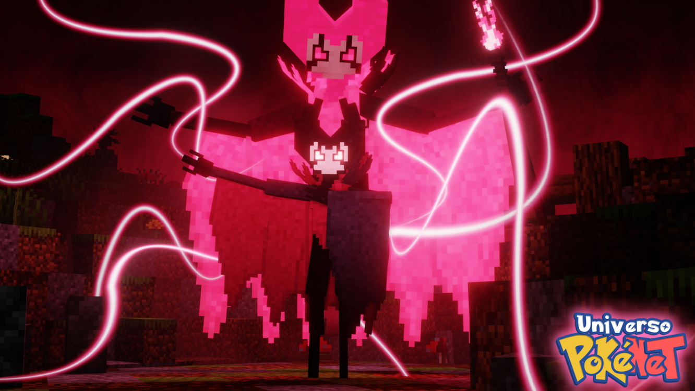

# 🎃 PokéNightmares 2025

El Evento halloween _(2025)_ de Universo PokéNet vuelve en la nueva modalidad **Cobblemon** trayendo nuevos pokémon de distintas sagas de videojuegos.

### 📷 Imagen PokéNightmares

Este Evento se introduce la skin especial **Grimm** **[Pokédex](../../pokemondecobblemon/pokedex.md)**. Al igual que varias Skins nuevas, un nuevo Gatchas, Mision y más.

### 📕 Misión

| 📕 Reino Pesadilla |
| :---: |
| [📕 Grimm](mision-grimm.md) 
| [📕 Noivern Nightmare](mision-noivern.md) 
| [📕 Jigglypuff Nightmare](mision-jigglypuff.md) 
| [📕 Kommo-o Nightmare](mision-kommoo.md) 
| [📕 Toxtricity Nightmare](mision-toxtricity.md) 

### 🗝️ Skins del Gatcha

| 🗝️ Gatcha PokéNightmares |
| :---: |
| [🗝️ Buzzwole Warden](gatcha-buzzwole_warden.md)
| [🗝️ Ariados Hazbin](gatcha-ariados_hazbin.md)

### 🏅 Skins del Pase

  | 🥈 Gratis | 🥇 Premium |
  | :----: | :----: |
  | [🥈 Yamask & cofagrius PokéNightmares](pase-yamask_cofagrius_nightmares.md)  | [🥇 Sneasler PokéNightmares](pase-sneasler_nightmares.md) |

### 💰 Skins de paga

| 💰 Tienda |
| :---: |
| [💰 Ursaning Fazbear](paga-ursaning_fazbear.md)
