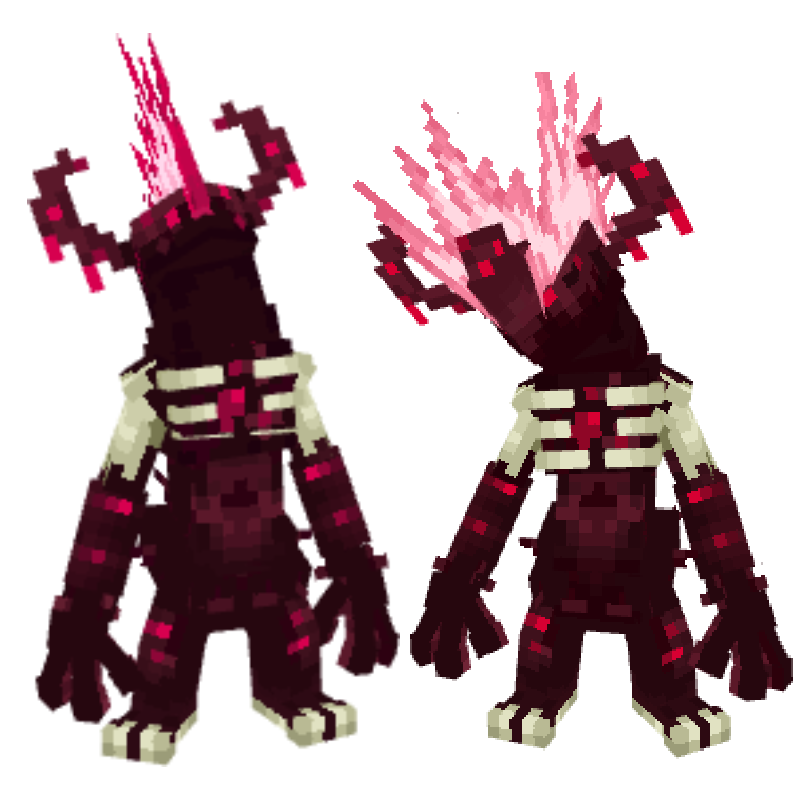
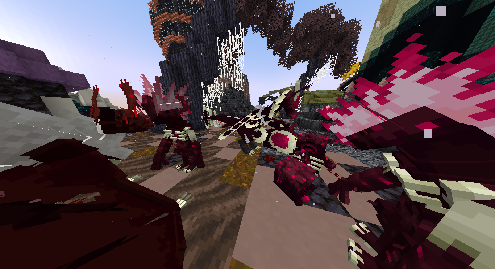

# 📕 Toxtricity NightmareChild

## Información

**Noivern forma Warden x Grimm** es una Skin exclusiva del servidor Cobblemon introducida en la [PokéNightmares](./).

|||
| ------------------------------: | -------------------------------------------------------------------------------------------------------------------------------------- |
|                      **Artwork** |                                                           |                                                                                                             |
|                      Creado por | YamatoDust                                                                                                                 |

### Comentario del desarrollador
La creación de esta skin hace referencia al un monstruo hostil ciego del juego **Minecraft** pero con la paleta de colores de la skin *Grimm*. 

## Obtención

Esta skin se consigue en el Mision temporal de **PokéNightmares 2025**.
