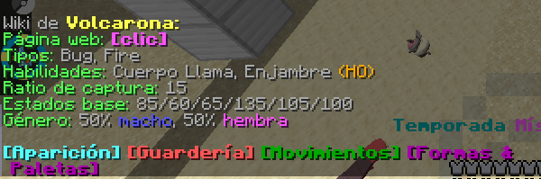
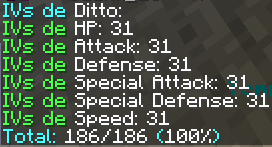

- - -

## description: >-

Creado por: Juniorcx
Descripción: Formas para entrenar a tu pokemon en Mundo PixelNet

- - -

# 🏋️‍♂️ Entrenamiento Pokemon

El entrenamiento pokemon consiste en llevar a tu pokemon a su maximo potencial o hacerlo encajar en tu estrategia de combate. Los Pokémon tienen una serie de estadísticas: **PS**, **ataque** , **defensa**, **ataque especial**, **defensa especial** y **velocidad**; el punto de entrenarlo es mejorar sus estaditicas ya sea por entrenar sus EVs o Naturaleza y enseñarles Movimientos que favorescan o aprovechem las estadisticas del pokemon.

En este apartado exploraremos las facilidades que ofrese Mundo Pixelnet en cuanto al entrenamiento pokemon y un pequeño ejemplo de ello.

## 🔬Estadisticas Base

Cada Pokémon, según su especie y tipo, tiene unas estadísticas base cuando el Pokémon nace, estas estadísticas sólo se utilizan para poder comparar un Pokémon con otro, por ejemplo:

| **#** | **Pokémon** | **PS** | **Ataque** | **Defensa** | **Ataque esp.** | **Defensa esp.** | **Velocidad** |
| --- | ------- | --- | ------ | ------- | ----------- | ------------ | --------- |
| 130 | **Gyarados** | 95 | 125 | 79 | 60 | 100 | 81 |
| 637 | **Volcarona** | 85 | 60 | 65 | 135 | 105 | 100 |

A partir de esta informacion podemos ir creando la estrategia para entrenar al pokemon, en el caso de Volcarona debes aprobechar al maximo su altisimo Ataque esp. junto ya sea a su velocidad o defensa esp. y enseñarle ataques de tipo especial.

En Mundo Pixelnet esta habilitado el comando `/wiki (stol o Pokemon)` con el que podras ver informacion sobre los pokemon incuido las Estadisticas base de cada uno.

## 🧬IVs o Valores Individiales

Los valores individuales (IVs) son los genes de los pokemon. Estos IVs existen para que los Pokémon no sean idénticos, pues aunque sean de la misma especie y naturaleza es muy improbable que sus estadísticas coincidan debido a la existencia de estos valores. Cada Pokémon posee un valor de IVs para cada una de sus 6 estadísticas (PS, ataque, defensa, ataque especial, defensa especial, velocidad). Ese valor va desde 0 hasta 31. Estos valores lo podemos ver con el comando `/ivs (slot)` o `/mostrar`.

Los IVs en si no son "entrenables" pero hay maneras de conseguir pokemones con IVs buenos. Recuerda que los IVs al 31 deben ser los de las estadisticas a Utilizar en ese Pokemon, por ejemplo en Volcarona el ataque esp. y la velocidad deben estar en 31 si o si.

### 🔗Cadena de Captura Pokemon

Esto consiste en atrapar un mismo pokemon una y otra vez, es decir, capturar Rattata's una y otra vez (*OJO SOLO RATTATA*) y así la cadena va aumentando. El objetivo es conseguir Pokemones con 3 o más IVs perfectos (31 puntos).

En [Mundo Pixelnet](../README.md) la Cadena de Captura funciona asi:

| Cadena de Captura | IVs Perfectos |
| :---------------: | :-----------: |
| 0 | 0 |
| 1-10 | 0 |
| 11-20 | 1 |
| 21-50 | 2 |
| 51+ | 3 |

*Estos son IVs asegurados, pueden salir con más de 3x31 IVs.*

### 🍥Chapas

En Pixelmon exisre la mecanica de subir IVs mediante Chapas de Botella.

* La **Chapa Plateada** es un objeto que aumenta una de las seis estadísticas (PS, Ataque, Defensa, Ataque Especial, Defensa Especial y Velocidad) de un Pokémon de nivel máximo para que actúe como si tuviera un IV perfecto. Cuando hagas clic derecho en un Pokémon de nivel máximo(100) con ella, podrás seleccionar qué estadística quieres aumentar.
Las chapas de plata se pueden obtener pescando en Oceanos con caña Buena o Supercaña con 4% de rareza, como botín en Raids de 3 a 5 estrellas y como botín especial de nivel 3 o 4, de Boss Epico, Lengendario y Unico.
* La **Chapa Dorada**  es un objeto que aumenta las estadísticas de un Pokémon de nivel máximo para que parezca que el Pokémon tiene IVs perfectos . Cuando haces clic derecho en un Pokémon de nivel máximo(100) con este objeto, se aumentarán todas las estadísticas (HP, ataque, defensa, ataque especial, defensa especial y velocidad) que no tengan un IV perfecto (a diferencia de la chapa plateada , que aumenta solo una estadística).
Las chapas de botellas doradas se pueden obtener mediante la pesca en oceanos con supercaña con una rareza de 0,1%, las Raid de 4 a 5 estrellas y como botin de Ultimate Boss Pokémon.

Las chapas de botellas solo afectan a los IV para fines de combate. No afectan el tipo de poder oculto ni la crianza.

### 💞Crianza

La Crianza consiste en cruzar pokemones con IVs perfectos para conseguir un pokemon con mejores IVs.
Hay un apartado dedicado a esto [Crianza](../Juniorcx/crianza.md).

## 💖Naturaleza Pokemon

Cada Pokémon tiene una naturaleza que influye en sus estadísticas. Esta naturaleza se determina aleatoriamente al encontrar al Pokémon y no se puede cambiar legítimamente una vez capturado. Cada naturaleza aumenta una estadística en un 10% y disminuye otra en un 10%. Ninguna naturaleza influye en los PS y ciertas naturalezas no afectan las estadísticas en absoluto. Por tanto, para sacar el máximo provecho de nuestro Pokémon debemos conseguir al que tiene la personalidad que mejor se ajusta a nuestra estrategia.

Por ejemplo, estamos entrenando a un Pokémon de ataques físicos y sin ataques especiales, la naturaleza/personalidad ideal sería la naturaleza **firme**, ya que aumenta el ataque y disminuye el ataque especial, pero como nuestro Pokémon no va a utilizar ataques especiales eso no nos afecta. En el caso de Volcarona seria **Timid/Miedosa** para aumentar su velocidad y bajando su Ataque que no afecta en nada.

| Naturaleza | Aumenta + | Disminuye - |
| ---------- | --------- | ----------- |
| Adamant/Firme | Attack/Ataque | Special Attack/Ataque Especial |
| Brave/Audaz | Attack/Ataque | Speed/Velocidad |
| Lonely/Huraña | Attack/Ataque | Defense/Defensa |
| Naughty/Pícara | Attack/Ataque | Special Defense/Defensa Especial |
| Bold/Osada | Defense/Defensa | Attack/Ataque |
| Impish/Agitada | Defense/Defensa | Special Attack/Ataque Especial |
| Lax/Floja | Defense/Defensa | Special Defense/Defensa Especial |
| Relaxed/Plácida | Defense/Defensa | Speed/Velocidad |
| Bashful/Tímida | None | None |
| Docile/Dócil | None | None |
| Hardy/Fuerte | None | None |
| Quirky/Rara | None | None |
| Serious/Seria | None | None |
| Mild/Afable | Special Attack/Ataque Especial | Defense/Defensa |
| Modest/Modesta | Special Attack/Ataque Especial | Attack/Ataque |
| Quiet/Mansa | Special Attack/Ataque Especial | Speed/Velocidad |
| Rash/Alocada | Special Attack/Ataque Especial | Special Defense/Defensa Especial |
| Calm/Serena | Special Defense/Defensa Especial | Attack/Ataque |
| Careful/Cauta | Special Defense/Defensa Especial | Special Attack/Ataque Especial |
| Gentle/Amable | Special Defense/Defensa Especial | Defense/Defensa |
| Sassy/Grosera | Special Defense/Defensa Especial | Speed/Velocidad |
| Hasty/Activa | Speed/Velocidad | Defense/Defensa |
| Jolly/Alegre | Speed/Velocidad | Special Attack/Ataque Especial |
| Naive/Ingenua | Speed/Velocidad | Special Defense/Defensa Especial |
| Timid/Miedosa | Speed/Velocidad | Attack/Ataque |

Antes de capturarlos, se puede cambiar la Naturaleza de un Pokémon al tener la habilidad Sincronizar en el primer Pokémon de tu grupo, configurando la Naturaleza para que sea la misma que la del Pokémon con la habilidad. Esta habilidad la tienen Abra y Ralts.

EN Mundo Pixelnet después de atraparlo, la naturaleza solo se puede cambiar con un Modificador Naturalez que los puedes odtener cono renconpensas de eventos, Gatchas o misiones y al ir completanto la Dex, los enciuentras en `/modificadores`; pero también se puede cambiar de manera efectiva al usar un Mint/Menta  en él, que cambia las estadísticas potenciadas y reducidas para reflejar otra Naturaleza en su lugar.(imagenes /mod natu)

## ⚔EVs o Puntos de esfuerzo

Los Puntos de Esfuerzo (también conocidos como PE, o EVs por su sigla en inglés) son puntos que mejoran las estadísticas de un Pokémon basados en las fortalezas del Pokémon rival al que han derrotado.

Los Pokémon pueden ganar seis tipos diferentes de EVs, uno por cada una de las seis estadísticas (PS, Ataque, Defensa, Ataque Especial, Defensa Especial y Velocidad), y cada Pokémon individualmente puede ganar hasta un máximo de 510 EVS, con un límite adicional de 252 EVs por estadística. Al ganar EVs en una cierta estadística, ésta aumentará gradualmente, con una razón final de 4 EVs equivaliendo a 1 punto en la estadística al nivel 100. Un Pokémon puede tener un máximo de 63 puntos extra en una determinada estadística, y un máximo total de 127 puntos de forma transversal en todas sus estadísticas, dados los efectos de los EVs. Los efectos de los EVs se aplican inmediatamente, por lo que no es necesario subir de nivel para visualizar sus efectos.

Continuando con el ejemplo de Volcarona seria bueno entrenarle los EVs asi; Ataque especial= 252, velocidad= 252 y Defensa= 6; de esta manera aprobechamos su altisimo ataque especial.

Hay varias maneras de entrenar EVs dentro de Mundo Pixelnet:

### Objetos

Ciertos objetos equipados permiten a quien los porta ganar EVs adicionales siempre que un Pokémon sea derrotado. No obstante, el Pokémon tendrá su Velocidad temporalmente reducida a la mitad mientras tenga equipado este tipo de objetos. Todos los siguientes objetos pueden ser obtenidos de Jefes Pokémon o Cofres de PokeBotín.

* Un Pokémon que tenga equipado un Brazal firme ganará el doble de los EVs normales de cualquier encuentro.
* Cuando un Pokémon que tiene equipado un objeto potenciador gana EVs, este recibirá 8 Evs adicionales en una estadística determinada, dependiendo de qué objeto potenciador tenga equipado.
* Las vitaminas incrementan un EVS específico en 10 puntos, pero no lo aumentarán más allá de los 100 EVs.
* Ciertas bayas disminuyen la cantidad de EVs que un Pokémon tiene en una determinada estadística en 10.

| Estadística | Objeto potenciador | Vitamina | Baya |
| ----------- | ------------------ | -------- | ---- |
| PS | Pesa recia | Más PS | Baya Grana |
| Ataque | Brazal recio | Proteína | Baya Algama |
| Defensa | Cinto recio | Hierro | Baya Ispero |
| Ataque Especial | Lente recia | Calcio | Baya Meluce |
| Defensa Especial | Banda recia | Zinc | Baya Uvav |
| Velocidad | Franja recia | Carburante | Baya Tamate |
 
| Stat | Power item | Vitamin | Berry |
| ---- | ---------- | ------- | ----- |
| HP | Power Weight | HP Up | Pomeg Berry |
| Attack | Power Brace | Protein | Kelpsy Berry |
| Defense | Power Belt | Iron | Qualot Berry |
| Special Attack | Power Lens | Calcium | Hondew Berry |
| Special Defense | Power Band | Zinc | Grepa Berry |
| Speed | Power Anklet | Carbos | Tamato Berry |

### Jugos EV o EV Juices

Los EV Juices son un conjunto de 6 elementos que aumentan los EV de las estadísticas correspondientes de un Pokémon de manera similar a las vitaminas . Los EV Juices también se crean dentro del infusor al combinar 2 bayas del mismo color. La cantidad de EV otorgada tiene 5 valores posibles, siendo 4, 8, 12, 16 y 32, que están determinados por la combinación de bayas utilizadas en el infusor.

| Stat/Estadistica | Juice/Jugo | Icono |
| ---------------- | ---------- | ----- |
| HP/PS | Purple Juice/Jugo Morado |  |
| Attack/Ataque | Red Juice/Jugo Rojo |  |
| Defense/Defensa | Yellow Juice/Jugo Amarillo |  |
| Special Attack/Ataque Especial | Blue Juice/Jugo Azul |  |
| Special Defense/Defensa Especial | Green Juice/Jugo Verde |  |
| Speed/Velocidad | Pink Juice/Jugo Rosado |  |

Fabricación de jugos EV:
Al preparar jugos EV, las bayas se pueden dividir en seis colores y tres grupos. Lo puedes ver en <b>[EV Juice](https://pixelmonmod.com/wiki/EV_Juices)</b>.

Los jugos EV se elaboran mezclando dos bayas del mismo color. Esto funciona de forma ligeramente diferente si las dos bayas utilizadas son iguales que si son diferentes. La siguiente tabla describe el aumento de EV que se obtendrá al mezclar dos bayas del mismo color para elaborar un jugo EV. Lo puedes ver en <b>[EV Juice](https://pixelmonmod.com/wiki/EV_Juices)</b>.

### Pokerus

Pokérus  es un virus beneficioso que puede aparecer aleatoriamente como un estado en un Pokémon, con un 1/12888 probabilidad y una tasa de propagación de 1/5. Por defecto, un Pokémon salvaje también puede contraer esta enfermedad, pero no se puede detectar hasta que se captura el Pokémon.

* Pokérus tiene el efecto de duplicar cualquier EV que reciba un Pokémon. Este efecto es acumulativo con Macho Brace , que luego te da un total de 4 EV por cada Pokémon derrotado. Si hay un portador en el grupo, el virus puede propagarse a otros Pokémon del grupo, incluidos los huevos.

El virus caduca automáticamente después de un período de tiempo de entre 1 y 4 días reales, según la cepa contraída. Una vez caduca, ya no se propaga, aunque sus efectos potenciadores de EV permanecerán.

### Entrenamiento

En Mundo Pixelne estan todas las mecanicas mencinadas y existen 2 `/warp` dedicads a este entrenamiendo uno es `/warp evs` donde encontraras entrenadores con pokemones nivel 1 de cada una de las estadisticas, y `/warp entrenamintovip` para los usruarios con [Rango](https://tienda.mundopixelnet.com/) igual al otro pero con mejore pokemones.
Las bayas las puedes encontrar salvaje o comprarlas en `/warp tiendas`.

## 💫Habilidades

Las habilidades son efectos pasivos que cada Pokémon tiene para usar en combate. Un Pokémon sólo puede tener una habilidad a la vez, la cual no puede ser cambiada. La habilidad de un Pokémon se decide en el momento en que es generado, siendo escogida de un conjunto de hasta tres posibles habilidades que el Pokémon puede tener, dependiendo de su especie.

Del conjunto de posibles habilidades que un Pokémon puede tener, una o dos habilidades normales y, posiblemente, una habilidad oculta. Si un Pokémon tiene dos habilidades normales posibles, existe la misma probabilidad para que cualquiera de ellas sea la habilidad de ese Pokémon. Las habilidades ocultas son significativamente más raras que las habilidades normales; un Pokémon tiene, por defecto, una probabilidad de 1/150 de tener su habilidad oculta. La combinación de tipos de habilidades que un Pokémon puede tener incluye:

* Una habilidad normal.
* Una habilidad normal y una habilidad oculta.
* Dos habilidades normales y una habilidad oculta.

*Las habilidades, incluyendo a las ocultas, pueden ser heredadas a través de la crianza.*

Un Pokémon puede cambiar entre sus dos habilidades normales usando una Cápsula Habilidad. Sin embargo, una Cápsula Habilidad no puede cambiar de una habilidad normal a una habilidad oculta, .Un Pokémon puede cambiar entre sus dos habilidades normales (si las tiene) usando una cápsula de habilidad . Sin embargo, una cápsula de habilidad no puede cambiar un Pokémon de su habilidad normal a su habilidad oculta y viceversa. Para cambiar a la Habilidadl Oculta se usa parche de habilidad.
*La capsula habilidad y el parche habilidad se pueden obtener en botin de Jefes/Boss Pokemon, Raids Dinamax o Misiones*.

Continuando con el ejemplo Volcarona tiene una habilidad (Cuerpo Llamas)y una habilidad oculta(Enjambre), se recominda Cuerpo Llamas ya que al contacto puede quemar al enemigo.

## 💥Movimientos

Una vez hecho todo lo anterior, tan sólo tenemos que seleccionar los movimientos que le convengan a nuestro Pokémon de entre todos los que puede aprender tanto por nivel, por MT, DT, tutor de movimientos, tutor de transferencia o movimiento huevo. Ya sean entre ataques especiales, ataques físicos o movimientos de estado.

Un movimiento o ataque (Move en inglés) es una técnica que los Pokémon son capaces de aprender y que usan en los combates con el fin de debilitar a sus oponentes. Solo puenden aprender 4 Movimientos a la vez y usar solo 1 por turno.

* Los movimientos de la clase **físico** provocan daño directo. Este daño depende de las características de ataque del Pokémon que los usa, y cuya cantidad de daño producido varía en función de las características de defensa del Pokémon objetivo del movimiento.
* Los movimientos de la clase **especial** provocan daño directo. Este daño depende de las características de ataque especial del Pokémon que los usa, y cuya cantidad de daño producido varía función de las características de defensa especial del Pokémon objetivo del movimiento.
* Los movimientos de la clase de **estado** por lo general, no provocan daño o solamente provocan daño indirecto y tienen efectos de apoyo en combate. Algunos de estos movimientos pueden ser protectores (como Protección), curativos (como Pecuperación), subir o bajar características del Pokémon que los usa o las del oponente (como maquinacion o Chirrido), provocar problemas de estado (como Toxico) o incluso afectar al campo de combate (como Día Soleado o Púas), pero hay muchos más con efectos variados.

En Mundo Pixelnet podemos enseñar movimientos facilmente en `/warp tutores` con Tutores de Movimiento divididos por tipo y un Recordador de Movimientos ademas en `/warp tiendas` hay un Comenciarte de MTs, sin embargo, los tutores de Trasferencia solo los puedes encontrar en el mundo survival y hay MTs que no se venden pero pueden ser "enseñados" de la misma manera que los DTs.

Para Volcarona es recomendable enseñarle Movimientos de clase Especial como Danza Llamas o Zumbido y gracias a que puede aprender Danza Aleto podemos Potenciarle.

## ✨Nivel/Level

Un nivel o Level es la fuerza del Pokémon registrada en un número del 1 al 100. Cuanto mayor es el nivel, más fuerte es el Pokémon. Los niveles indican la fuerza del Pokémon. Al subir un nivel se pueden aprender nuevos movimientos. También es la forma de evolucionar de la mayoría de los Pokémon, aunque algunos lo hacen mediante otros métodos como las piedras evolutivas. Cuando se sube un nivel también se muestra cuánto aumenta cada estadística.

Para subir de Nivel los pokemones necesitan acumualar experiencia obtenida en los combates Pokémon u objetos como los Caramelos Raros o Caramelos de Experiencia.

En Mundo Pixelnet los usuarios disponen de una zona espacial para aumentar de nivel facilmente en `/warp niveles` o `/warp entrenamientovip` donde se enfrentarar a Entrenadores con pokemones que no hacen daño permitiendo ser derrotados mas facilmente, ganando esperiencia de forma sensilla y equipamos al pokemon con un Huevo suerte ganara el doble de experiencia o un repartir Exp y no tendria necesidas de combatir el pokemon.

## 🎁Objetos de Utilidad

Los Pokemones pueden portar ciertos objetos durante el combate, estos objetos pueden proporcionan varios beneficios al Pokémon en combate ya sea recuperar PS , curar un estado , aumentar una estadística y otros efectos.

Pueden Ser:

* **Bayas:** tienen distintos efectos, algunas debilitan los movimientos superefectivos y otras curan los estados de salud.
* **Orbes:** estos objetos permiten a Groudon y Kyogre experimentar la Reversión Primordial cuando los sostienen.
* **Gemas:** aumentan el poder de un tipo específico de movimiento en un 30%.
* **Megapiedras:** Estos objetos, cuando están en manos de sus respectivos Pokémon, permitirán al poseedor experimentar una megaevolución durante la batalla.
* **Cristales Z:** Es necesario tener Cristales Z para realizar movimientos Z.
* **Objetos Potenciadores:** al sostenerlos, aumentarán ciertas estadísticas de los Pokémon. Algunos solo los pueden usar determinados Pokémon.
* Entre muchos otros...

Continuando el ejemplo de Volcarona seria crucial equiparle un objeto que aumente su Velociada o el Ataque especial, aunque tambien se le podria equipar una Banda Focus son el fin de Potenciarle con Danza Aleteo ya que nos aseguraremos que sobrevivira el 1re turno(eso si no se usa un ataque de mas de 1 golpe).

# 📂 Referencias

[Wiki de Pixelmon Mod EN](https://pixelmonmod.com/wiki/Main_Page)
[Wikidex](wikidex.net)
[PokeFandom](pokemon.fandom.com)