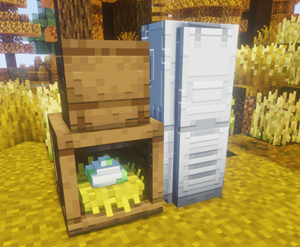

# 💘 Guía de Crianza

En esta guía aprenderás a criar desde 0, criar con naturaleza, pasar movimientos huevo y más...

# 🛍 Requisitos

En general, se necesitan dos Pokémon de sexos opuestos para reproducirse  . Además, ambos deben ser parte del mismo [Grupo de Huevos](https://bulbapedia.bulbagarden.net/wiki/Egg_Group), o un Pokémon cualquiera que pueda criar y un Ditto. 

## Por parte de los materiales, necesitarás:

| **Material** | **Imagen** | **Material** | **Imagen** |
| ------------ | :--------: | ------------ | :--------: |
| **Bloque de Pastura/Pasture Block** |  | **Lazo Destino/Destiny Knot** |  |
| **Pesa Recia/Power Weight** |  | **Brazal Recio/Power Bracer** |  |
| **Cinto Recio/Power Belt** |  | **Lente Recia/Power Lens** |  |
| **Banda Recia/Power Band** |  | **Franja Recia/Power Anklet** |  |

# 🎎 Crianza en Cobbreeding/Cobblemon

Primero expliquemos cómo funciona la crianza en Cobblemon.

## ¿Cómo funciona?
 
El Bloque de Pastura de Cobblemon te permite seleccionar Pokémon de tu PC para que deambulen por el área. Si colocas Pokémon compatibles dentro, podrían poner un huevo que aparecerá en la parte inferior del bloque. Puedes recogerlo haciendo clic derecho en el huevo o colocando una tolva debajo del Bloque de Pastura para que los huevos se recojan automáticamente.

Hay un 40 % de probabilidad cada 10 minutos de que aparezca un huevo en el Bloque de Pastura si los Pokémon que contiene pueden reproducirse.

Recibirás el huevo del Pokémon como objeto. Eclosionará con el tiempo si lo dejas en tu inventario. Puedes acelerar este proceso si tienes en tu equipo un Pokémon con la habilidad **Cuerpo Llama**, **Armadura Magma** o **Motor de Vapor**.

## 🎭 Herencia

Los padres pueden transmitir varios rasgos que poseen a su descendencia.

### 🧬 IV

En conjunto, los dos progenitores transmitirán tres de los seis IVs aleatorios a su descendencia. Estos IVs no se superpondrán entre sí (es decir, la madre y el padre no pueden transmitir ambos el mismo IV). Ciertos objetos equipados pueden influir en los IVs heredados.

#### Los objetos que influyen en la herencia de los IVs son:

* **Lazo Destino** : si lo tiene equipado cualquiera de los padres, se pasarán cinco IVs entre ambos padres a la descendencia en lugar de tres.
* **Los Objetos Recios o Power Items**, que hacen heredar un IV específico:

| **Objeto Recio** | **Estadística/IV** |
| ----------------- | :----------------: |
| Pesa Recia/Power Weight  | Vida/HP |
| Brazal Recio/Power Bracer  | Ataque/Attack |
| Cinto Recio/Power Belt  | Defensa/Defense |
| Lente Recia/Power Lens  | Ataque Especial/Special Attack |
| Banda Recia/Power Band  | Defensa Especial/Special Defense |
| Franja Recia/Power Anklet  | Velocidad/Speed |

> **Si ambos padres poseen un objeto recio se heredará solo 1 aleatoriamente**

### 💫 Habilidad

La crianza cruzada añade una pequeña probabilidad de obtener la **habilidad oculta** del Pokémon mediante la reproducción. Si la madre ya posee su habilidad oculta, la probabilidad de transmitirla será del 60%.  
Si la madre posee una habilidad normal, la probabilidad de que la descendencia obtenga la habilidad oculta será:

* 10% si el Pokémon tiene 3 habilidades posibles.
* 20% si el Pokémon tiene 2 habilidades posibles.

###  Movimientos huevo

Al criar, se revisarán todos los movimientos de ambos padres para transmitir los movimientos huevo que correspondan al Pokémon en el huevo. Esto incluye el conjunto de movimientos actual, así como los movimientos en banca/guardados.

⚠️ *Si, por alguna razón, un movimiento de los padres no se transmite correctamente, intenta incluirlo en los movimientos en banca del Pokémon.*

####  Hierba Copia

Si un Pokémon en pastoreo lleva una **Hierba Copia**, aprenderá movimientos de huevo del Pokémon con el que está en pastoreo. El Pokémon que enseña y el que recibe el movimiento no necesitan pertenecer al mismo grupo de huevos para que se transfiera.  
La Hierba Copia se activará cada vez que el Bloque de Pastura intente generar un huevo, incluso si no lo consigue.

⚠️ *Si, por alguna razón, un movimiento del conjunto de movimientos de los Pokémon padres no se transmite correctamente, intenta incluirlo en los movimientos de banca del Pokémon.*

### 🎨 Formas y Aspectos

La forma regional se hereda directamente de la madre sin necesidad de una Piedra Eterna.  
Esto también aplica a aspectos como las variantes de salto de Magikarp, el color de la flor de Flabébé, los Pokémon Valencianos, Mooshtank, etc.

> **NOTA:** *Para los Pokémon bebés no son necesarios los inciensos, ya que al criar Pokémon de esa especie, el huevo resultante será el Pokémon bebé y no su forma base.*

### 🍀 Naturaleza

Si un progenitor posee la **Piedra Eterna** , la **Naturaleza** de los descendientes siempre coincidirá con la naturaleza del progenitor que tiene equipada la Piedra Eterna. Si ambos progenitores poseen Piedras Eternas, los descendientes heredarán aleatoriamente una de las naturalezas de los progenitores.

## ✨ Caza de shiny

El método de caza shiny es el **Masuda**. Este método aumentará las probabilidades en X4 si los padres tienen un Entrenador Original (OT) diferente.

# 💚 Crianza desde 0

## 🔹 Paso 1

El primer paso es conseguir los Pokémon con buenos IVs (los IVs son los valores individuales con los que nace el Pokémon y no pueden ser entrenados; van desde 0 a 31).

Con el comando `/mostrar` y eligiendo el Pokémon, verás sus atributos colocando el puntero sobre el nombre del Pokémon en el chat, o directamente desde el menú de party con `M`.

Una vez tengamos nuestros Pokémon un 31 IVs o más y de géneros diferentes, iremos al Bloque de Pastura.

> **NOTA IMPORTANTE:** Los IVs **no** perfectos de uno de los Pokémon deben coincidir con los IVs perfectos del otro, para que entre ambos estén los 6 IVs perfectos.

## 🔹 Paso 2

Una vez tengamos a los dos Pokémon 1x31, 2x31 o 3x31, con los 6 IVs perfectos entre ambos, macho y hembra, procedemos a equipar los objetos necesarios.

1. Es necesario equipar a un Pokémon el **Lazo Destino** para que la cría herede 5 IVs. Al otro le equipamos un **Objeto Recio** de la estadística que él tenga perfecta y el otro no.

2. El objetivo es ir obteniendo crías con más IVs perfectos y cruzarlas con uno de los padres o entre ellas, dependiendo del caso, hasta obtener dos crías 5x31 que fallen en diferentes IVs.

3. Al tener los 2 Pokémon 5x31, procedemos a criarlos (como se explica en el punto 1) una y otra vez hasta obtener un Pokémon 6x31/**Perfecto** (*preferiblemente macho*).

Te preguntarás cómo se obtiene un Pokémon 6x31 IVs si el Lazo Destino permite heredar solo 5. Esto se logra con suerte, ya que el sexto IV es totalmente aleatorio y puede ser entre 0 y 31. Si se tiene la suficiente suerte, ese IV aleatorio puede ser un 31.

> **Nota:** Una cría puede salir 6x31 de cualquier combinación de cría (mientras tengan entre ambos padres los 6 IVs). Ya sea dos 3x31 o un 1x31 y un 5x31, todo es cuestión de suerte.

# 💙 Crianza a Partir de un Padre Perfecto (6X31 IVs)

Esto es un poco más fácil, basta con tener un macho  6x31 del mismo grupo huevo del Pokémon que quieres criar, pero tiene algunas restricciones:

* Solo aplica a Pokémon que tengan **género**,  o .
* Solo aplica a Pokémon que puedan ser **hembra** .
* Solo aplica a Pokémon que compartan un [**Grupo de Huevos**](https://bulbapedia.bulbagarden.net/wiki/Egg_Group).
* Los Grupos Huevo **Ditto** y **Undiscovered** no pueden criar por este método.

En este método no es necesario tener una hembra 3x31 o más (es más rápido sí, pero no es estrictamente necesario). Basta con tener una hembra del Pokémon que quieras criar y un macho 6x31 con un grupo huevo en común.

* Equipar a la hembra el **Lazo Destino** para que la cría herede 5 IVs y al macho le equipamos un **Objeto Recio** de la estadística que te interese heredar a la cría o una **Piedra Eterna** si quieres pasar la naturaleza.
* El punto aquí es ir obteniendo crías hembras con más IVs perfectos y cruzarlas con el macho perfecto hasta obtener crías 5x31 o 6x31.

*El Lazo Destino debe llevarlo siempre el Pokémon con menos IVs.*

## 💛 5x31 Asegurado

* 🟡 **Con un Pokémon 6x31 y un 5x31:**  
El **Lazo Destino**  va en el Pokémon 5x31 y el Pokémon 6x31 debe llevar el **Recio** del IV que le falta al 5x31.
* 🟡 **Con 2 Pokémon 6x31:**  
El **Lazo Destino**  va en un Pokémon y el otro Pokémon debe llevar un **Recio** del IV que quieras heredar o una **Piedra Eterna**  para pasar naturaleza.

# 💜 Crianza con Ditto 

La crianza con Ditto es el método más efectivo para criar, ya que Ditto puede criar con casi todos los Pokémon con cualquier género o sin género  .

### Consideraciones:

1. Aplica para todos los Grupos Huevos menos **Grupo Ditto** y **Grupo Undiscovered**.
2. No puedes criar Ditto con Ditto.
3. Aplica a Pokémon que tengan género   o no, *mientras cumpla el punto 1 y 2.*

## 🟣 Con Dittos no 6x31

Es un poco engorroso porque Ditto no puede aumentar sus IVs base, ya que solo es obtenible por captura. Lo mejor será capturar Dittos lo más perfectos posible y cubrir entre todos ellos los 6 IVs.

Para criar con este método, suponiendo que son 6 Dittos 1x31 y uno de cada IV:

1. Equipar a cada Ditto con el **Recio** correspondiente a su IV 31 y el **Lazo Destino**  al Pokémon que queremos criar.
2. Una vez que las crías vayan heredando los IVs, ir rotando los Dittos y las crías. Por ejemplo, si en la primera cría heredó el IV de Velocidad, a esa le equipamos el Lazo Destino y la criamos con otro Ditto, por ejemplo, el Ditto de Ataque, hasta que una cría herede ambos IVs.
3. Seguir así sucesivamente hasta obtener una cría 5x31 o 6x31.

> ***Es el mismo procedimiento para Dittos 2x31, 3x31, 4x31 y 5x31.***

## 🟣 Con Ditto 6x31

Este es por mucho el método más eficaz para criar Pokémon.  
Para conseguir un Ditto 6x31 hay dos maneras: capturándolo salvaje (con mucha suerte) o comprándolo junto con el paquete de crianza de la tienda de [Universo PokéNet](../README.md) en [Tienda UniversoPixelnet](https://tienda.mundopixelnet.com/)***(Proximamente)***.

Para criar con este método basta con cruzar el Ditto 6x31 con otro Pokémon y después cruzarlo con esa cría, teniendo en cuenta las consideraciones expuestas en el apartado anterior.

1. Si solo quieres subir IVs, es recomendable que el Ditto tenga equipado el **Recio** del IV que quieras heredar. Si no es así, equipar la **Piedra Eterna**  si quieres pasar la naturaleza del Ditto o el **Lazo Destino**  si quieres pasar la naturaleza del otro Pokémon con una Piedra Eterna equipada.
2. Al ir engendrando crías con mejores IVs, cruzar esas crías con el Ditto e ir rotando los recios de Ditto hasta obtener una cría 5x31 o 6x31.

# 💌 Consejos

* Cobblemon impedirá que un Pokémon aparezca si el área es demasiado pequeña. Asegúrate de que haya suficiente espacio detrás del Bloque de Pastura.
* Los Pokémon en pastoreo aún pueden desmayarse debido a peligros. Mantén tu zona de pastoreo completamente a salvo de cualquier daño.
* Si tus Pokémon en pastoreo desaparecen y vuelven al PC, puede deberse a que se alejan demasiado del Bloque de Pastura.
* Si el Bloque de Pastura no está cargado, no funcionará y, por lo tanto, no intentará poner huevos. Mantente cerca de este cuando estés criando.
* El temporizador del huevo se puede desincronizar entre el servidor y el cliente. Sin embargo, el servidor es quien decide cuándo el huevo está listo para eclosionar. El huevo simplemente eclosionará cuando el temporizador del servidor llegue a 0.
* Puedes colocar varias parejas compatibles o un padre y dos madres compatibles pero solo se colocara un huevo cada ciclo alternando entre las especies que esten pastando.

# 📂 Referencias

[Guía de Cobbreeding](https://docs.google.com/document/d/1Hk5Iqnzm2NqkXGwzUIvPVFKhAwVHSEM3hyP3Qdhl5g4/edit?tab=t.0#heading=h.qwag8bhw3vol) por Ludichat. *Se tradujo y adapto al servidor*
