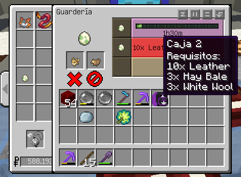
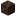
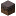
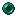

# 💘 Crianza

## 💘 Guía de Crianza

En esta guía aprenderás a criar desde 0, criar con naturaleza, pasar movimientos huevo y más...

## 🛍Requisitos

En general, se necesitan dos Pokémon de sexos opuestos para reproducirse  . Además, ambos deben ser parte del mismo [Grupo de Huevos](https://pixelmonmod.com/wiki/Egg_Group), o un pokemon cualquiera y un Ditto. 

### Por parte de los materiales necesitarás:

|                               |                                                       |                               |                                                        |
| ----------------------------- | :---------------------------------------------------: | ----------------------------- | :----------------------------------------------------: |
| **Guardería/DayCare**         |        | **Lazo Destino/Destiny Knot** |  |
| **Piedra Eterna/ Ever Stone** |  | **Hierba Copia/Mirror Herb**  |   |
| **Pesa Recia/Power Weight**   |   | **Brazal Recio/Power Bracer** |  |
| **Cinto Recio/Power Belt**    |    | **Lente Recia/Power Lens**    |     |
| **Banda Recia/Power Band**    |    | **Franja Recia/Power Anklet** |  |
|                               |                                                       |                               |                                                        |

_Con esto puedes criar casi cualquier cosa. Más adelante habrá otros items/objetos necesarios pero son específicos para ciertos pokemones._

## Crianza en Pixelmon

Primero expliquemos como funciona la crianza en Pixelmon.

### Herencia

Los padres pueden transmitir varios rasgos que poseen a su descendencia.

#### 🧬 IV

En conjunto, los dos progenitores transmitirán tres de los seis IVs aleatorios a su descendencia. Estos IVs no se superpondrán entre sí (es decir, la madre y el padre no pueden transmitir ambos el mismo IV). Ciertos objetos equipados pueden influir en los IVs heredados.

**Los objetos que influyen en la herencia de los IVs son:**

* **Lazo Destino** : si lo tiene equipado cualquiera de los padres, se pasarán cinco IVs de los padres a la descendencia en lugar de tres.
* **Los Objetos Recios o Power Items** que hace heredar un IV en espesifico:

| **Objeto Recio**                                                                 |        **Estadística/IV**        |
| -------------------------------------------------------------------------------- | :------------------------------: |
| Pesa Recia/Power Weight      |              Vida/HP             |
| Brazal Recio/Power Bracer  |           Ataque/Attack          |
| Cinto Recio/Power Belt        |          Defensa/Defense         |
| Lente Recia/Power Lens        |  Ataque Especial/Special Attack  |
| Banda recia/Power Band        | Defensa Especial/Special Defense |
| Franja Recia/Power Anklet  |          Velocidad/Speed         |

#### 📏 Tamaño

Los Tamaños de las crías se heredan de sus padres. La herencia del Tamaño está determinada por la diferencia entre los Tamaños de la madre y el padre (por ejemplo, ordinario está directamente entre enano y gigante), con alguna variación aleatoria que permite heredar dos tamaños que estén directamente al lado del tamaño determinado (usando el ejemplo anterior, también serían posibles heredar tamaños pequeños y enormes). Esta ligera variación en el tamaño ocurrirá incluso si ambos padres tienen el mismo tamaño. Esta es la única forma de obtener Pokémon que sean microscópicos o gigantescos, requiriendo que dos Pokémon que sean pigmeos o dos Pokémon que sean enormes (respectivamente) se reproduzcan juntos. Cada cría de estos Pokémon tendrá una probabilidad de 50% de heredar las estadísticas de tamaño extremo correspondientes.

#### 💫 Habilidad

* La madre  tiene un 80% de posibilidad de transmitir su habilidad a su descendencia, a menos que se trate de una habilidad oculta, en cuyo caso tendrá un 60% de posibilidad de transmitirse a su descendencia. La habilidad del macho  no tiene ninguna relación con la habilidad heredada si hay una madre presente.
* Si un Pokémon macho  se reproduce con un Ditto , la habilidad del Pokémon macho  tiene un 60 % de probabilidad de transmitirse. Esto se aplica tanto a las habilidades normales como a las ocultas. La habilidad del Ditto  no afecta a esta probabilidad.
* Si la habilidad no se transmite a la descendencia, la cría obtiene aleatoriamente una de las habilidades básicas de su especie. Esto puede dar como resultado la recuperación de la habilidad del padre si éste transmitía una habilidad básica.

_La probabilidad (por defecto) de obtener una habilidad oculta no está presente durante la reproducción. Si ninguna de las afirmaciones anteriores permite la herencia de una habilidad oculta, no hay probabilidad de que la descendencia tenga habilidades ocultas._

#### 💥 Movimiento Huevo

Si la madre  o el padre  tienen ciertos movimientos, sus hijos podrían potencialmente heredar esos movimientos a pesar de que normalmente no puedan aprenderlos.

1. Si el padre  o la madre  (o ambos) conocen ciertos movimientos de "**Huevo**" específicos de la especie, sus crías los heredarán. La mayoría de estos movimientos no pueden ser aprendidos por los Pokémon excepto con este método.
2. Si el padre conoce algún movimiento que pueda enseñarse a través de **TM** o **DM**, la descendencia heredará esos movimientos si puede aprenderlos normalmente a través de **TM/DM**.
3. Si tanto la madre  como el padre  conocen movimientos que están en el conjunto de movimientos de nivel superior de sus hijos, estos los heredarán. Esto puede provocar que los hijos conozcan movimientos que normalmente solo podrían aprender en niveles superiores.

Si más de cuatro movimientos cumplen con los criterios anteriores, los movimientos que tendrá la descendencia se deciden utilizando la lista anterior como jerarquía; es decir, los movimientos Huevo tienen prioridad sobre los demás criterios. Si hay más de cuatro movimientos huevo potenciales para heredar, se priorizan los movimientos huevo de la madre .

Además, la **Hierba Copia**  también permite que a los Pokémon existentes se les dé un Movimiento Huevo de otra especie que tenga ese movimiento Huevo. El Pokémon que necesita el movimiento Huevo tendrá la Hierba Copia y debe tener un espacio de movimiento vacío. El Pokémon que conoce el movimiento Huevo no tiene requisitos. Los dos Pokémon no necesitan ser compatibles de ninguna manera (grupo Huevo, género, etc.), y no se produce descendencia cuando están en la Guardería . Finalmente, el primer Pokémon aprenderá el movimiento Huevo requerido. Esto permite que los Pokémon solo machos  y sin género aprendan movimientos Huevo.

_Un ejemplo de esto es Azumarill aprendiendo Belly Drum. Si Azumarill tiene la Hierba Copia y tiene un espacio vacío, cualquier Pokémon que conozca Belly Drum puede ser llevado a la Guardería con ella. Este podría ser un Poliwag o incluso un Snorlax . Azumarill eventualmente aprenderá Belly Drum._

**Nota:** _Si un Pikachu o un Raichu se reproduce mientras sostiene una Bola de Luz , la cría Pichu conocerá el movimiento Volt Tackle independientemente de si los padres conocen el movimiento._

#### ♻ Forma Regional y Naturaleza

Si un progenitor posee la **Piedra Eterna** , las **Formas Regionales** y/o la **Naturaleza** de los descendientes siempre coincidirán con la del progenitor que posea la Piedra Eterna. Si ambos progenitores poseen Piedras Eternas, los descendientes heredarán aleatoriamente una de las Naturalezas de los progenitores.

_Al criar Pokémon en forma regional, la descendencia siempre tendrá la forma no regional predeterminada de ese Pokémon, a menos que un progenitor con forma regional posea una piedra eterna_ _, en cuyo caso se adoptará la forma del progenitor que posea la piedra eterna._

### Proceso de Crianza

Para que dos Pokémon compatibles puedan reproducirse, deben contar con los elementos necesarios. Por defecto, hay tres elementos diferentes para cada tipo. Los elementos necesarios para un Pokémon dependen únicamente de su tipo primario (por ejemplo, Gastly solo necesitará los elementos de la categoría fantasma).

En Universo PokéNet los requisitos fueron alterados del original aca se deja una tabla actualizada.

**Tabla de Requerimientos por Tipo**

| Normal                                                                                                                                                                                                                                          | Hada                                                                                                                                                                                                                                                                          | Bicho                                                                                                                                                                                                                                                        |
| ----------------------------------------------------------------------------------------------------------------------------------------------------------------------------------------------------------------------------------------------- | ----------------------------------------------------------------------------------------------------------------------------------------------------------------------------------------------------------------------------------------------------------------------------- | ------------------------------------------------------------------------------------------------------------------------------------------------------------------------------------------------------------------------------------------------------------ |
|                                                                                                                                                                                                 |                                                                                                                                                                                                                                   |                                                                                                                                                                                                                |
| 
10x Leather/Cuero  3x Hay Bale/Heno  3x White Wool/Lana Blanca 
 | 
1x Cake/Pastel  3x Lily of the Valley/Lirio del Valle  3x Chorus Fruit/Fruta Chorus 
 | 
2x Dandelion/Diente de Leon  3x Cobweb/Telaraña  3x Spider Eye/Ojo de Araña 
 |

| Acero                                                                                                                                                                                                                                                                                       | Planta                                                                                                                                                                                                                                                 | Fantasma                                                                                                                                                                                                                                                                           |
| ------------------------------------------------------------------------------------------------------------------------------------------------------------------------------------------------------------------------------------------------------------------------------------------- | ------------------------------------------------------------------------------------------------------------------------------------------------------------------------------------------------------------------------------------------------------ | ---------------------------------------------------------------------------------------------------------------------------------------------------------------------------------------------------------------------------------------------------------------------------------- |
|                                                                                                                                                                                                                                               |                                                                                                                                                                                                        |                                                                                                                                                                                                                                |
| 
3x Block of Iron/Bloque de Hiero  3x Iron Bars/Barras de Hierro  2x Silver Block/Bloque de Plata 
 | 
5x Grass/Hierba  3x Oak Leaves/Hojas de Roble  3x Grass Block/Cesped 
 | 
10x Ghast Tear/Lagrima de Ghast  3x Soul Torch/Antorcha de Almas  3x Soul Sand/Arena de almas 
 |

| Tierra                                                                                                                                                                                                                                                                      | Roca                                                                                                                                                                                                                                           | Veneno                                                                                                                                                                                                                                                                            |
| --------------------------------------------------------------------------------------------------------------------------------------------------------------------------------------------------------------------------------------------------------------------------- | ---------------------------------------------------------------------------------------------------------------------------------------------------------------------------------------------------------------------------------------------- | --------------------------------------------------------------------------------------------------------------------------------------------------------------------------------------------------------------------------------------------------------------------------------- |
|                                                                                                                                                                                                                             |                                                                                                                                                                                                    |                                                                                                                                                                                                                                   |
| 
3x Clay/Arcilla  3x Brown Terracotta/Terracota Marron  3x Soul Soil/Tierra de almas 
 | 
15x Blackstone/Piedranegra  5x Granite/Granito  10x Stone/Piedra 
 | 
1x Brewing Stand/Soporte de pociones  3x Mycelium/Micelio  3x Slime Block/Bloque de Slime 
 |

| Volador                                                                                                                                                                                                                        | Siniestro                                                                                                                                                                                                                                                                  | Agua                                                                                                                                                                                                                                                                      |
| ------------------------------------------------------------------------------------------------------------------------------------------------------------------------------------------------------------------------------ | -------------------------------------------------------------------------------------------------------------------------------------------------------------------------------------------------------------------------------------------------------------------------- | ------------------------------------------------------------------------------------------------------------------------------------------------------------------------------------------------------------------------------------------------------------------------- |
|                                                                                                                                                                              |                                                                                                                                                                                                                      |                                                                                                                                                                                                                               |
| 
10x Feather/Pluma  3x Glass/Cristal  3x Target/Diana 
 | 
2x Block of Coal/Bloque de Carbon  5x Blackstone/Piedranegra  1x Obsidian/Obsidiana 
 | 
3x Scute/Escama de Tortuga  2x Water Bucket/Cubo de Agua  5x Fresh Water/ Agua Fresca 
 |

| Fuego                                                                                                                                                                                                                                                                                  | Dagon                                                                                                                                                                                                                                                                                              | Electrico                                                                                                                                                                                                                                                                                                       |
| -------------------------------------------------------------------------------------------------------------------------------------------------------------------------------------------------------------------------------------------------------------------------------------- | -------------------------------------------------------------------------------------------------------------------------------------------------------------------------------------------------------------------------------------------------------------------------------------------------- | --------------------------------------------------------------------------------------------------------------------------------------------------------------------------------------------------------------------------------------------------------------------------------------------------------------- |
|                                                                                                                                                                                                                                          |                                                                                                                                                                                                                                                     |                                                                                                                                                                                                                                                           |
| 
5x Flint and Steel/Mechero  2x Lava Bucket/Cubo de Lava  2x Blaze Rod/Bara de Blaze 
 | 
3x Diamond/Diamente  1x Block of Gold/Bloque de Oro  10x Nether Wart Block/Bloque de Berrugas del Nether 
 | 
2x Block of Redstone/Bloque de Redstone  3x Glowstone&#x26;Piedra Luminosa  2x Redstone Lamp/Lampara de Redstone 
 |

| Hielo                                                                                                                                                                                                                                                  | Psiquico                                                                                                                                                                                                                                           | Lucha                                                                                                                                                                                                                                                                                  |
| ------------------------------------------------------------------------------------------------------------------------------------------------------------------------------------------------------------------------------------------------------ | -------------------------------------------------------------------------------------------------------------------------------------------------------------------------------------------------------------------------------------------------- | -------------------------------------------------------------------------------------------------------------------------------------------------------------------------------------------------------------------------------------------------------------------------------------- |
|                                                                                                                                                                                                          |                                                                                                                                                                                                |                                                                                                                                                                                                                                          |
| 
10x Ice/Hielo  1x Blue Ice/Hielo Azul  5x Snow Block/Bloque de Nieve 
 | 
8x Ender Pearl/Ender Perla  3x Bookshelf/Libreria  2x Clock/Reloj 
 | 
2x Oak Planks/Tablones de Roble  2x Bricks/Bloque de Ladrillo  2x Temple Brick/Ladrillos de Templo 
 |

Una vez que ambos Pokémon hayan recibido los elementos necesarios, se iniciará el proceso de crianza seleccionando la marca de verificación verde. El proceso, por defecto, tarda un total de 1,5 horas o 90 minutos/1 hora y 30 minutos.

Al criar Pokemones de **Tipos** diferentes necesitarás 6 elementos, los 3 de cada tipo; y el tiempo de crianza aumentará al doble, 3 horas.

Puedes abandonar la guardería hasta que finalice el proceso. Mientras tanto, puedes revisar tu inventario para comprobar cómo van tus crías.

> _Es posible saltarse un único requisito para un Pokémon usando el Reloj de Arena de Cobre de Isi_ _. Puedes usar el Reloj de Arena de Plata de Isi_  _para saltarte el 25% del temporizador para que un Pokémon se reproduzca._

> **Nota:** _El reloj de arena dorado de Isi_  _es un elemento de un solo uso que se puede usar en una guardería para hacer que una sola caja de guardería complete todos los requisitos de reproducción y complete el temporizador de reproducción. Este reloj solo se consigue mediante recompensa de eventos, misiones o nivel del pase._

### Eclosión

Después de reclamar un Huevo , el jugador debe caminar con el Huevo hasta que eclosione. Un Huevo no eclosionará ni estará cerca de eclosionar mientras esté almacenado en la PC . En la pantalla de resumen de un Huevo, en lugar de la información habitual, solo hay un indicador de aproximadamente cuánto tiempo tardará el Huevo en eclosionar.

Después de una cantidad suficiente de pasos, el Huevo eclosionará. Un "paso" en lo que respecta a la eclosión de un Huevo equivale al tiempo que se tarda en recorrer la longitud total de dos bloques a velocidad normal. Los métodos para aumentar la velocidad de desplazamiento, como montar un Pokémon, aumentarán la velocidad a la que se deducen los pasos del Huevo. La cantidad de pasos necesarios para que un Huevo eclosione depende de la especie de Pokémon que se encuentre dentro del Huevo.

Con el comando `/eggstep usuario (slot)` puedes ver los pasos que faltan para la eclosión.

> _**Si en el Equipo del jugador hay un Pokémon con Flame Body/Cuerpo Llama o Magma Armor/Escudo Magma o Steam Engine/Combustible , los Huevos del grupo del jugador eclosionarán el doble de rápido. Este efecto no se acumula si varios Pokémon del equipo tienen Flame Body o Magma Armor.**_

## 💚 Criar desde 0

### 🔷 Paso 1

El paso 1 es conseguir los Pokemones con buenos IVs (los IVs son los valores individuales con los que nace el pokemon y no pueden ser entrenados; van desde 0 a 31). ¿Cómo lo hacemos? Fácil! Mediante la Cadena de captura pokemon.

#### 🔗 Cadena de Captura o Racha de Captura

Esto consiste en atrapar una misma especie de pokemon una y otra vez, es decir, capturar Rattata una y otra vez (_OJO SOLO RATTATA_) y así la cadena va aumentando. El objetivo es conseguir Pokemones con 3 o más IVs perfectos (31 puntos).

En [Universo PokéNet](../) la Cadena de Captura funciona asi:

| Cadena de Captura | IVs Perfectos |
| :---------------: | :-----------: |
|         0         |       0       |
|        1-10       |       0       |
|       11-20       |       1       |
|       21-50       |       2       |
|        51+        |       3       |

> _Estos son IVs asegurados, pueden salir con más de 3x31 IVs_

> \[!NOTE] La Cadena de captura solo funciona/aplica con pokemones generados naturalmente, no se aplica a generados por Spawners como en los Safaris o Spawners de mundo Survival, sin embargo, estos pokemones generados por spawners si cuentan al subir la racha. Se pueden usar estos pokemones para empezar la racha y continuarla con pokemones generados naturalmente.

Para ver los IVs de un Pokemon en [Universo PokéNet](../) hay dos maneras:

* Con el comando Mostrar: `/mostrar` y eliges el pokemon, verás sus atributos colocando el puntero sobre el chat en el nombre del pokemon.
* Con el comando IVS: `/ivs <slot>` Slot es el número que ocupa el pokemon en tu equipo (_funciona con los huevos_ ).

Una vez tengamos nuestros Pokemones 3X31 IVs o más y género diferentes, iremos a la Maquina de Crianza.

> **NOTA IMPORTANTE:** Los Ivs **no** perfectos de uno de los pokemones deben coinsidir con los IVs perfectos del otro, así de esta manera están los 6 IVs perfectos con ambos pokemones.

> **NOTA:** Para hacer la cadena recomiendo las VelozBall , AcopioBall  y NivelBall . Ya que estas son muy buenas, las Velozball al primer turno para hacerlo rápido, las AcopioBall por es un X5 en pokemones ya capturados (perfectas para esto) y las NivelBall para pokes de bajo nivel.

### 🔷 Paso 2

#### Proceso de Criar

En esta parte de la guía aprenderemos a criar desde 0 a un pokemon perfecto 6x31 para usarlo como padre para futuras crías; en el ejemplo usaremos a Bidoof. 

Una vez tengamos a los dos Bidoof 3x31 macho y hembra, procedemos a equipar los objetos necesarios.

1. Si o si es necesario equipar a un pokemon el Lazo Destino  para que las crías herede 5 IVs, al otro le equipamos un Recio de la estadística que él tenga perfecta y el otro no.

2. El punto es ir obteniendo crías con más IVs perfectos y cruzarles con uno de los padres o entre ellas hasta obtener dos crías 5x31 que fallen en diferentes IVs.
3. Al tener los 2 Bidoof 5x31, procedemos a criarlos (como se explica en el punto 1) una y otra vez hasta obtener un Bidoof 6x31 (Preferiblemente macho ).

Te preguntarás cómo se obtiene un pokemon 6x31 IVs si el Lazo Destino permite heredar solo 5, pues con suerte, ya que el Sexto IV es totalmente aleatorio, pude ser entre 0 y 31. Si se tiene la suficiente suerte, ese IV aleatorio puede ser un 31.

> **Nota:** Una cría puede salir 6x31 de cualquier combinación de cría (mientras tengan entre ambos padres las 6 IVs). Ya sea dos 3x31 o un 1x31 y un 5x31, todo es cuestión de suerte.

## 💙 Criar Pokemones a Partir de un Padre Perfecto (6X31 IVs)

Esto es un poco más fácil basta con tener un Macho  6x31 del mismo grupo huevo del pokemon que quieres criar, pero tiene algunas restricciones:

1. Solo aplica a Pokemones que tengan **Género**,  o .
2. Solo aplica a Pokemones que puedan ser **Hembra** .
3. Solo aplica a Pokemones que compartan un **Grupo Huevo**.
4. Los Grupos Huevo **Ditto** y **Undiscovered** no pueden criar por este método.

Lo bueno de este método es que no es necesario hacer cadena para tener una hembra  3x31 o más (es más rápido sí, pero no es estrictamente necesario). Basta con tener una hembra del pokemon que quieras criar y un macho 6x31 del mismo grupo huevo.

Continuando con el ejemplo de Bidoof, criaremos un Eevee ya que ambos comparten el grupo huevo **Campo**.

1. Equipar a Eevee el Lazo Destino  para que la cría herede 5 IVs y a Bidoof le equipamos un Recio de la estadística que te interese heredar a la cría o una Piedra Eterna si quieres pasar la naturaleza o Forma.
2. El punto aquí es ir obteniendo crías Eevee **Hembras**  con más IVs perfectos y cruzarles con el Bidoof  perfecto hasta obtener crías 5x31 o 6x31.

> _El lazo destino debe llevarlo siempre el pokemon con menos IVs_

### 5x31 Asegurado

* **Con un pokemon 6x31 y un 5x31.** El Lazo Destino  va en el pokemon 5x31 y el pokemon 6x31 debe llevar el Recio del IV que falla el 5x31.

* **Con 2 pokemones 6x31.** El Lazo Destino  va en un pokemon y el otro pokemon debe llevar un Recio del IV que quieras heredar o una Piedra Eterna  para pasar naturaleza y/o forma regional.

## 💜 Crianza con Ditto 

La crianza con Ditto es el método más efectivo para criar, ya que Ditto puede criar con casi todos los pokemones con cualquier género o sin genero  . Consideraciones:

1. Aplica para todos los Grupos Huevos menos **Grupo Ditto** y **Grupo Undiscovered**.
2. No puedes criar ditto con ditto.
3. Aplica a pokemones que tengan género   o no. _Mientras cumpla el punto 1 y 2._

### Con Dittos no 6x31

Es un poco engorroso porque Ditto no puede aumentar sus IVs base, ya que solo es obtenible por captura. Lo mejor será capturar dittos lo más perfecto posible y cubrir entre todos ellos los 6 IVs.

Para criar con este método, suponiendo que son 6 Dittos 1x31 y uno de cada IVs:

1. Equipar a cada Ditto con el recio correspondiente a su IVs 31 y el Lazo Destino  al pokemon que queremos criar.
2. Una vez que las crías vayan heredando los IVs ir rotando los Dittos y las crías, es decir, si en la primera cría heredo el IV de Velocidad, a esa le equipamos el Lazo destino y lo criamos con otro Ditto por ejemplo el Ditto de Ataque, hasta que una cría herede ambos IVs.
3. Seguir así sucesivamente hasta obtener una cría 5x31 o 6x31.

> _**Es el mismo procedimiento para Dittos 2x31, 3x31, 4x31 y 5x31**_

### Con Ditto 6x31

Este es por mucho el método más eficaz para criar pokemones. Para conseguir un Ditto 6x31 hay dos maneras, ya sea capturándolo salvaje (con mucha suerte) o comprándolo junto con el paquete de crianza de la tienda de [Universo PokéNet](../) en [Tienda MundoPixelnet](https://tienda.mundopixelnet.com/). Para criar con este método basta con cruzar el Ditto 6x31 con otro pokemon y después cruzarle con esa cría, teniendo en cuenta las consideraciones expuestas en el apartado anterior.

1. Si solo quieres subir IVs es recomendable que el Ditto tenga equipado el Recio del IV que quieras heredar. Si no es así, equipar la Piedra Eterna  si quieres pasar la Naturaleza del Ditto o el Lazo Destino  si quieres pasar la Naturaleza del otro pokemon con una Piedra Eterna equipada.
2. Al ir engendrando crías con mejores IVs cruzar esas crias con el Ditto e ir rotando los recios de Ditto hasta obtener una cría 5x31 o 6x31.

## 💛Crianza con Naturaleza o Forma

### Naturaleza

Una vez tengamos al Pokemon que queremos criar con la naturaleza deseada procedemos a equipar los objetos necesarios. (_Nota: puede ser tanto el padre o la madre y no necesariamente el poke que sera cria, ya que puede ser el papa 6x31 que comparta el grupo huevo._)

Si o si es necesario equipar al pokemon con la naturaleza con la piedra eterna para que las crías herede la naturaleza, al otro le equipamos un lazo destino para pasar 5 IVs.

El punto es ir obteniendo crías con más IVs perfectos y la naturaleza deseada para cruzarles con uno de los padres o entre ellas hasta obtener dos crías 5x31 que fallen en diferentes IVs y luego criarlas entre si hasta obtener un 6x31 con la naturaleza que quieres. (Recordando equipar la piedra eterna en el pokecon la naturaleza).

### Forma Regional

Una vez tengamos al Pokemon que queremos criar con la Forma deseada procedemos a equipar los objetos necesarios. (_Nota: puede ser tanto el padre o la madre mientras sean de la misma especie, de lo contrario debe ser la madre quien debe tener la forma._)

Si o si es necesario equipar la piedra eterna al pokemon con la forma para que las crías herede esa forma, al otro le equipamos un lazo destino para pasar 5 IVs.

El punto es ir obteniendo crías con más IVs perfectos y la forma deseada para cruzarles con uno de los padres o entre ellas hasta obtener dos crías 5x31 que fallen en diferentes IVs y luego criarlas entre si hasta obtener un 6x31 con la forma que quieres. (Recordando equipar la piedra eterna en el pokecon la forma regional).

## 🎞 Videos



## 🔰 Consideraciones

* En [Universo PokéNet](../) al comprar ciertos [Rangos](https://tienda.mundopixelnet.com/category/ranks) te dan acceso a comandos que facilitan el proceso de crianza. Son:
  * El /hatch: `/hatch usuario (slot)` con este comando podemos abrir directamente un huevo sin necesidad de caminar.
  * El /breed: `/breed usuario (slot) (slot)` con este comando podemos criar sin necesidad de una guardería y nos da el huevo al instante.
* Algunos Pokémon, como Snorlax , no producirán sus formas base a menos que la madre  tenga equipado un incienso determinado . Sin el incienso, estos Pokémon producirán las formas evolutivas inmediatamente posteriores a sus formas base (por ejemplo, criar un Snorlax sin un Incienso Lento producirá un Huevo que contenga otro Snorlax en lugar de un Munchlax ). Estos Pokémon y sus inciensos necesarios se enumeran a continuación.

> - Chansey , Blissey → Happiny : Incienso Duplo/Luck 
> - Chimecho → Chingling : Incienso Puro/Pure 
> - Mantine → Mantyke : Incienso de Agua/Wave 
> - Marill , Azumarill → Azurill : Incienso Marino/Sea 
> - Mr. Mime → Mime Jr. : Incienso Raro/Odd 
> - Roselia , Roserade → Budew : Incienso Floral/Rose 
> - Snorlax → Munchlax : Incienso Lento/Full 
> - Sudowoodo → Bonsly : Incienso de Roca/Rock 
> - Wobbuffet → Wynaut : Incienso Suave/Lax 

* Si un Nidoran♀ se reproduce o un Nidoran♂ , Nidorino o Nidoking y un Ditto se reproducen, el huevo resultante puede contener Nidoran♀ o Nidoran♂ .
* Si un Illumise se reproduce o un Volbeat y un Ditto se reproducen, el Huevo resultante puede contener a Illumise o a Volbeat .
* Si los padres tienen entrenadores originales diferentes, sus hijos tienen seis veces más posibilidades de ser Shiny . Esto se combina con el aumento triple del talismán Shiny para obtener una probabilidad máxima del 0,44 % de que el hijo sea Shiny.

## 💌 Consejos

1. Recolectar los materiales requeridos por la Guarderia, en gran cantidad porque criar es algo de constancia y paciencia.
2. Recomiando para empezar con pokemones de tipo planta, bicho, roca o tierra, ya que los materiales requeridos son relativamente facieles de farmear.
3. Poner un temporizador con el tiempo de crianza para que sea lo mas eficiente posible.
4. Las Habilidades ocultas se pueden obtener con un Parche Habilidad  y si un pokemon tiene mas de una Habilidad normal puedes usar una Capsula Habilidad para cambiar entre ellas . _NOTA: Si un pokemon tiene habilidad oculta no puede cambiar con objetos._
5. La modificacion de IVs por Chapas no afecta en nada la crianza, es decir, el pokemon pasara los IVs que tenia antes de usar chapas.

## 📂 Referencias

[Wiki de Pixelmon Mod EN](https://pixelmonmod.com/wiki/Main_Page) _Se tradujo gran parte de su Breeding Guides y se uso de base para esta guia_.

Colaboradores: Juank\_16, gametito, Y4MAT0sama.

## 🗒 Nota

Cualquier comentario, consejo o idea es bien recibido.
