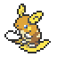
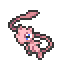
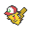
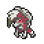
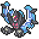

# 🛒 LISTADO DE PRECIOS
¡Bievenidos al apartado de "listado de precios"! Aquí encontrarás un listado de precios mínimos a los cuales vender tus Pokémon/objetos en el servidor.

Dicha lista de precios es meramente orientativa y sirve para tener una idea de a qué precios mínimos vender, pudiendo así vender a más, pero no a menos de lo permitido, la lista es **oficial** aunque puede estar sujeta a cambios según como vaya la economía en el servidor.

**El incumplimiento de esta lista de precios mínimos puede llevar sanción.**

Está separado en diferfentes categorías: **Balls**, **Minerales**, **Crianza**, **Tablas**, **Máquinas**, **Megapiedras**, **Objetos evolutivos**, **Objetos competitivos**, **Otros**, **Encantamientos**, **Bayas**, **Gemas**, **Partes de Porygon**, **Fósiles**, **Cristales Z**, **Discos de Silvally**, **ROMs de Genesect**, **Pokémon Legendarios (según naturaleza)**, **Ultraentes**, **Pokémon Especiales**, **Crianza** y **Modificadores**.

Si tenéis alguna sugerencia y/o nos ha faltado algo, ¡no dudes en escribirla en nuestro servidor de Discord!

# Balls x Stack

|  Imagen |Nombre  |  Precio  | Descripción |
| - | - | - | - |
|   |Poké Ball  | 5K   |Ratio de captura x1. |
| | Super Ball |10K |Ratio de captura x2.   |
|   |Ultra Ball |20K  |Ratio de captura x3.  |
|   |Buceo Ball |10K |Ratio x3.5 si el Pokémon está en el agua.   |
|   |Ocaso Ball |20K   |Ratio x3.0 en lugares de poca luz. |
|   |Rapid Ball |10K |El ratio aumenta hasta x4 con los Pokémon de mayor velocidad base de 100.   |
|   |Amigo Ball |10K |Aumenta la felicidad de los Pokémon capturados. |
|  |Sana Ball |10K |Sana a los Pokémon capturados.    |
|   |Peso Ball |10K |Aumenta el ratio con los Pokémon pesados.    |
|   |Nivel Ball|20K |Ratio más alto si el nivel del Pokémon es bajo.    |
|   |Amor Ball |10k   |El ratio aumenta si los Pokémon son de distinto género.   |
|   |Cebo Ball  |20K | Ratio x5 en los encuentros por pesca.  |
|   |Lujo Ball  |15K |El Pokémon capturado gana felicidad rápidamente.     |
|   |Luna Ball  |10K |Ratio x4 si el Pokémon se evoluciona con Piedra Lunar.   |
|   |Nido Ball |15K |Aumenta el ratio con Pokémon bajo nivel.   |
|   |Malla Ball| 10K |Ratio x3 con Pokémon tipo bicho y agua.    |
|   |Honor Ball |8K  |Da efecto de partículas al sacarlos de la Ball. |
|   |Veloz Ball |20K |Ratio x5 si se usa en el primer turno.    |
|   |Acopio Ball |15K   |Ratio x3 si ya capturaste esa especie.|
|   |Safari Ball |10K |Ratio x1.5 en planicies.   |
|   |Competi Ball |10K | Ratio x1.5 Pokémon tipo bicho.  |
|   |Turno Ball |15K   |Mientras más dura el combate más alto es el ratio.|
|   |Ensueño Ball  |20K   |Ratio x4 en Pokémon dormidos. |

# Balls x Unidad

|Imagen   | Nombre  | Precio  |Descripción |
| - | - | - | - |
|  | Gloria Ball |5K|Poké Ball de evento.    |
|   | Master Ball |80K |Nunca falla.   |
|   | Parque Ball |80K |Nunca falla.   |
|   |Ente Ball |100k |Ratio x5 en Ultraentes.    |
|   |GS Ball   |50K  |Se usa para invocar a Celebi.   |
|   |Origen Ball  |50K |Poké Ball de evento.   |
|   |Extraña Ball  |10K |Poké Ball especial. Ratio de captura x1.    |
|   |Navidad Ball  |25K |Poké Ball especial. Ratio de captura x1.   |

# Mineral x Stack

|Mineral  |Precio   |
| - | - |
|Mena de hierro   |16K   |
|Oro   |18K   |
|Mena de Bauxita o Aluminio   |16K   |
|Diamante   |20K   |
|Redstone   |3K   |
|Plata   |22K   |
|Carbón   |7K   |
|Cristal   |10K   |
|Silicio   |10K   |
|Rubí y Zafiro   |10K   |
|Esmeralda   |20K   |
|Platino   |22K   |

# Objetos de Crianza

|Icono   |Nombre |Precio |Descripción |
| - | - | - | - |
|   |Inciensos |15K   | |
|   |Cápsula Habilidad|20K|Permite cambiar la habilidad a un Pokémon que tiene dos.    |
|   |Piedra eterna|10K |Impide la evolución del Pokémon que la lleve equipada. Y sirve para traspasar la Naturaleza en la crianza.   |
|   |Lazo destino|50K |Hace que si el portador se enamora de un Pokémon, dicho Pokémon se enamore también del portador. Y sirve para traspasar 5 IVs al azar en la crianza.    |
|   |Pesa Recia |40K    |El Pokémon que la lleve equipada recibe 4 puntos de esfuerzo (EVs) extra en PS al participar en la derrota de un Pokémon en un combate. Y sirve para traspasar el IV de los PS en la crianza. |
|   |Lente Recia|40K   |Ataque Especial |
|   |Brazal Recio|40K   |Ataque |
|   |Cinto Recio |40K   |Defensa |
|   |Banda Recia|40K   |Defensa Especial |
|   |Franja Recia|40K   |Velocidad |

# Tablas

|Icono   |Nombre  |Precio   |Descripción|
| - | - | - | - |
|   |Tabla Draco   |25K   | |
|   |Tabla Oscura   |25K    | |
|   |Tabla Terrax   |25K    | |
|   |Tabla Fuerte   |25K    | |
|   |Tabla Llama   |25K    | |
|   |Tabla Helada   |25K    | |
|   |Tabla Bicho  |25K    | |
|   |Tabla Pradal   |25K    | |
|   |Tabla Mental   |25K    | |
|   |Tabla Duende  |25K    | |
|   |Tabla Cielo   |25K    | |
|   |Tabla Linfa   |25K    | |
|   |Tabla Terror   |25K    | |
|   |Tabla Pétrea   |25K    | |
|   |Tabla Tóxica   |25K    | |
|   |Tabla Trueno   |25K    | |
|   |Tabla Neutra   |25K    | |
|   |Tabla Legendaria   |30K    | |

# Máquinas

|Icono   |Nombre  |Precio   |Descripción|
| - | - | - | - |
|   | PC  |5K   |   |
|   | Infusor   |5K   |   |
|   |Máquina de curación   |5K   |   |
|   |Limpiador de fósiles   |5K   |   |
|   |Máquina de fósiles   |15K   |   |
|   |Máquina de Intercambio   |5K   |   |
|   |Placa de movimiento   |2K   |   |
|   |Elevador   |1K   |   |
|   |Máquina de Clonación   |50K   |   |
|   |Guardería   |27K   |   |

# Megapiedras

|Icono   |Nombre  |Precio   |Descripción|
| - | - | - | - |
|   |Abomasnowita   |40k-60k   |Megapiedra para Megaevolucionar a Abomasnow   |
|   |Absolita   |50k-75k   |Megapiedra para Megaevolucionar a Absol   |
|   |Aerodactylita   |100k-120k   |Megapiedra para Megaevolucionar a Aerodactyl   |
|   |Aggronita   |50k-75k   |Megapiedra para Megaevolucionar a Aggro  |
|   |Alakazamita   |50k-75k   |Megapiedra para Megaevolucionar a Alakazam  |
|   |Altarianita   |100k-120k   |Megapiedra para Megaevolucionar a Altaria  |
|   |Ampharosita   |50k-60k   |Megapiedra para Megaevolucionar a Ampharos  |
|   |Audinita   |40k-60k   |Megapiedra para Megaevolucionar a Audino  |
|   |Banettita   |50k-60k   |Megapiedra para Megaevolucionar a Banette  |
|   |Beedrillita   |20k-30k   |Megapiedra para Megaevolucionar a Beedrill  |
|   |Blastoisita   |100k-120k   |Megapiedra para Megaevolucionar a Blastoise  |
|   |Blazikenita   |120k-140k   |Megapiedra para Megaevolucionar a Blaziken  |
|   |Cameruptita   |50k-60k   |Megapiedra para Megaevolucionar a Camerupt  |
|   |Charizardita X   |200k-220k   |Megapiedra para Megaevolucionar a Charizard  |
|   |Charizardita Y   |200k-220k   |Megapiedra para Megaevolucionar a  Charizard |
|   |Diancita   |120k-140k   |Megapiedra para Megaevolucionar a Diancie  |
|   |Galladita   |70k-90k   |Megapiedra para Megaevolucionar a Gallade  |
|   |Garchompita   |130k-150k   |Megapiedra para Megaevolucionar a Garchomp  |
|   |Gardevoirita   |120k-140k   |Megapiedra para Megaevolucionar a Gardevoir  |
|   |Gengarita   |90k-100k   |Megapiedra para Megaevolucionar a Gengar   |
|   |Glalita   |40k-50k   |Megapiedra para Megaevolucionar a Glalie   |
|   |Sharpedonita   |70k-90k   |Megapiedra para Megaevolucionar a Sharpedo   |
|   |Steelixita   |60k-70k   |Megapiedra para Megaevolucionar a Steelix   |
|   |Tyranitarita   |130k-150k   |Megapiedra para Megaevolucionar a Tyranita   |
|   |Gyaradosita   |100k-120k   |Megapiedra para Megaevolucionar a Gyarados   |
|   |Heracrossita   |40k-50k   |Megapiedra para Megaevolucionar a Heracross   |
|   |Houndoomita   |60k-70k   |Megapiedra para Megaevolucionar a Houndoom   |
|   |Kangaskhanita   |90k-100k  |Megapiedra para Megaevolucionar a Kangaskhan   |
|   |Latiasita   |170k-200ks   |Megapiedra para Megaevolucionar a Latias  |
|   |Latiosita   |150-180k   |Megapiedra para Megaevolucionar a Latios  |
|   |Lopunnita   |180k-200k   |Megapiedra para Megaevolucionar a Lopunny  |
|   |Lucarita   |130k-150k   |Megapiedra para Megaevolucionar a Lucario  |
|   |Manectricita   |60k-70k   |Megapiedra para Megaevolucionar a Manectric  |
|   |Mawilita   |60k-70k   |Megapiedra para Megaevolucionar a Mawile  |
|   |Medichamita   |80k-90k   |Megapiedra para Megaevolucionar a Medicham  |
|   |Metagrossita   |130k-150k   |Megapiedra para Megaevolucionar a Metagross   |
|   |Mewtwoita X   |220k-240k   |Megapiedra para Megaevolucionar a Mewtwo   |
|   |Mewtwoita Y   |230k-250k   |Megapiedra para Megaevolucionar a Mewtwo   |
|   |Pidgeotita   |40k-50k   |Megapiedra para Megaevolucionar a Pidgeot  |
|   |Pinsirita   |70k-80k   | Megapiedra para Megaevolucionar a Pinsir |
|   |Sableynita   |50k-60k   |Megapiedra para Megaevolucionar a Sableye  |
|   |Salamencita   |130k-150k   |Megapiedra para Megaevolucionar a Salamence  |
|   |Sceptilita   |120k-140k   |Megapiedra para Megaevolucionar a Sceptile  |
|   |Scizorita   |90k-100k   |Megapiedra para Megaevolucionar a Scizor  |
|   |Slowbronita   |60k-70k   |Megapiedra para Megaevolucionar a Slowbro  |
|   |Swampertita   |120k-140k   |Megapiedra para Megaevolucionar a Swampert  |
|   |Venusaurita   |100k-120k   |Megapiedra para Megaevolucionar a Venusaur  |

# Objetos de Evolución

|Icono   |Nombre  |Precio   |Descripción|
| - | - | - | - |
|   |Piedra Hielo   |   |Sirve para evolucionar a algunas especies de Pokémon.   |
|   |Piedra Alba   |   |Sirve para evolucionar a algunas especies de Pokémon.   |
|   |Piedra Fuego   |   |Sirve para evolucionar a algunas especies de Pokémon.   |
|   |Piedra Hoja   |   |Sirve para evolucionar a algunas especies de Pokémon.   |
|   |Piedra Lunar   |   |Sirve para evolucionar a algunas especies de Pokémon.   |
|   |Piedra Día   |   |Sirve para evolucionar a algunas especies de Pokémon.   |
|   |Piedra Solar   |   |Sirve para evolucionar a algunas especies de Pokémon.   |
|   |Piedra Trueno   |   |Sirve para evolucionar a algunas especies de Pokémon.   |
|   |Piedra Noche   |   |Sirve para evolucionar a algunas especies de Pokémon.   |
|   |Piedra Agua   |   |Sirve para evolucionar a algunas especies de Pokémon.   |
|   |Escama marina   |   |   |
|   |Diente marino   |   |   |
|   |Escamadragón   |   |   |
|   |   |   |   |
|   |   |   |   |
|   |   |   |   |
|   |   |   |   |
|   |   |   |   |
|   |   |   |   |
|   |   |   |   |
|   |   |   |   |
|   |   |   |   |
|   |   |   |   |
|   |   |   |   |
|   |   |   |   |
|   |   |   |   |
|   |   |   |   |
|   |   |   |   |

# Objetos Competitivos

|Icono   |Nombre  |Precio   |Descripción|
| - | - | - | - |
|   |   |   |   |
|   |   |   |   |
|   |   |   |   |

# Otros (por unidad)

|Icono   |Nombre  |Precio   |
| - | - | - |
|   |Carameloraro   |2K   |
|   |Refresco Raro   |5K   |
|   |Caramelo EXP XL   |6K   |
|   |Caramelo EXP L   |3K   |
|   |Caramelo EXP M    |3K    |
|   |Caramelo EXP S   |3K    |
|   |Caramelo EXP XS    |3K    |
|   |Foto Pokémon   |1K   |
|   |RT/DT/MT   |   |
|   |Estrella del Nether   |150K   |
|   |Faro   | 25K  |
|   |Disco de Música   |2K   |
|   |Lente Plateada de Ras   |50K   |
|   |Lente Dorada de Ras   |500K   |
|   |Riendas Unión   |100K   |
|   |Manuscrito de las Sombras   |100K   |
|   |Manuscrito de las Aguas   |100K   |
|   |Espada Oxidada   |50K   |
|   |Escudo Oxidado   |50K    |
|   |Reloj de Arena argénteo de Isis   |5K   |
|   |Reloj de Arena aúrico de Isis   |15K   |
|   |Ala Arcoiris   |100K   |
|   |Supercaña   |35K   |
|   |Chapa Plateada   |20K   |
|   |Chapa Dorada   |100K   |
|   |Fragmento Azul   |10K   |
|   |Fragmento Rojo   |10K   |
|   |Orbe Azul   |90K   |
|   |Orbe Rojo   |90K    |
|   |Rubí de la Emoción   |75K   |
|   |Rubí del Conocimiento   |75K   |
|   |Rubí de la Voluntad   |75K   |
|   |Cadena Roja   |225K   |
|   |Campana Clara   | 90K  |
|   |Campana Oleaje  | 90K  |
|   |Botella de Prisión   |50K   |
|   |Gracídea  |20K   |
|   |Meteorito   |20K   |
|   |Punta ADN   |50K   |
|   |Repartir Exp   |70K   |
|   |Compartir Exp   |40K   |
|   |Necrosol   |Necrosol   |
|   |Necroluna   |Necroluna   |
|   |Orbe vacío   |50K   |
|   |Orbe lleno   |100K   |
|   |Bonguris (por stack)   |5K    |
|   |Elitras   |10K   |

# Encantamientos

|Icono   |Nombre  |Precio   |
| - | - | - |
|   |Reparación   |50K   |
|   |Irrompibilidad III   |50K   |
|   |El resto de encantamientos   | 30K   |

# Bayas

|Icono   |Nombre  |Precio   |Descripción|
| - | - | - | - |
|   |Todas   |valen   |10K   |

# Gemas

|Icono   |Nombre  |Precio   |Descripción|
| - | - | - | - |
|   |Gema Bicho   |2K   |   |
|   |Gema Siniestro   |2K   |   |
|   |Gema Dragón   |2K   |   |
|   |Gema Eléctrico   |2K   |   |
|   |Gema Hada   |2K   |   |
|   |Gema Lucha   |2K   |   |
|   |Gema Fuego   |2K   |   |
|   |Gema Volador   |2K   |   |
|   |Gema Fantasma   |2K   |   |
|   |Gema Planta   |2K   |   |
|   |Gema Tierra   |2K   |   |
|   |Gema Normal   |2K   |   |
|   |Gema Veneno   |2K   |   |
|   |Gema Psíquico   |2K   |   |
|   |Gema Roca   |2K   |  |
|   |Gema Agua   |2K   |   |

# Partes de Porygon

|Icono   |Nombre  |Precio   |Descripción|
| - | - | - | - |
|   |Porygon (completo)   |10K   |   |
|   |Cuerpo de Porygon   |1K   |   |
|   |Pierna de Porygon   |1K   |   |
|   |Cola de Porygon   |1K   |   |
|   |Cabeza de Porygon   |1K   |   |

# Fósiles (por unidad)

|Icono   |Nombre  |Precio   |Resultado Fósil|
| - | - | - | - |
|   |Fósil Hélix   |20K   |Omanyte   |
|   |Fósil Domo  |20K   |Kabuto   |
|   |Ámbar Viejo   |20K   |Aerodactyl   |
|   |Fósil Raíz   |20K   |Lileep   |
|   |Fósil Garra  |20K   |Anorith   |
|   |Fósil Cráneo  |20K   |Cranidos   |
|   |Fósil Coraza  |20K   |Shieldon   |
|   |Fósil Tapa  |20K   |Tirtouga   |
|   |Fósil Pluma  |20K   |Archen   |
|   |Fósil Mandíbula  |20K   |Tyrunt   |
|   |Fósil Aleta  |20K   |Amaura   |
|   |Ornitofósil   |40K   |Arctozolt (+Plesiofósil)/Dracozolt (+Dracofósil)   |
|   |Iciofósil  |40K   |Dracovish (+Dracofósil)/Actovish (+Plesiofósil)    |
|   |Dracofósil |40K    |Dracozolt (+Ornitofósil)/Dracovish (+Iciofósil)   |
|   |Plesiofósil   |40K    |Arctozolt (+Ornitofósil)/Arctovish (+Iciofósil)   |

# Cristales Z

|Icono   |Nombre  |Precio   |Tipo/Pokémon|
| - | - | - | - |
|   |Metalostal Z  |20K   |   |
|   |Hidrostal Z   |20K   |   |
|   |Insectostal Z   |20K   |   |
|   |Dracostal Z   |20K   |   |
|   |Electrostal Z   |20K   |   |
|   |Espectrostal Z   |20K   |   |
|   |Pirostal Z   |20K   |   |
|   |Feeristal Z   |20K   |   |
|   |Criostal Z   |20K   |   |
|   |Lizastal Z   |20K   |   |
|   |Normalstal Z   |20K   |   |
|   |Fitostal Z   |20K   |   |
|   |Psicostal Z   |20K   |   |
|   |Litostal Z   |20K   |   |
|   |Nicostal Z   |20K   |   |
|   |Geostal Z   |20K   |   |
|   |Toxistal Z   |20K   |   |
|   |Aerostal Z   |20K   |   |
|   |Pikastal Z   |70K   |   |
|   |Alo-Raistal Z   |70K    |   |
|   |Eeveestal Z   |70K    |   |
|   |Snorlastal Z   |70K    |   |
|   |Dueyestal Z   |70K    |   |
|   |Incinostal Z   |70K    |   |
|   |Primastal Z   |70K    |   |
|   |Tapistal Z   |80K   |   |
|   |Mewstal Z   |80K    |   |
|   |Ash-Pikastal Z   |70K   |   |
|   |Marshastal Z   |80K   |   |
|   |Kommostal Z   |100K   |   |
|   |Lycanrostal Z   |100K    |     |
|   |Mimikyustal Z   |100K    |   |
|   |Solgaleostal Z   |50K   |   |
|   |Lunalastal Z   |50K   |   |
|   |Ultranecrostal Z   |100K |   |

# Discos de Silvally

|Icono   |Nombre  |Precio   |Descripción|
| - | - | - | - |
|   |Todos   | valen  | 15k  |

# ROMs de Genesect

|Icono   |Nombre  |Precio   |Descripción|
| - | - | - | - |
|   |Todos    |valen   |10k   |

# Pokémon Legendarios y Singulares

|Sprite   |Nombre  |Precio   |Naturaleza favorable|
| - | - | - | - |
|   |Articuno   |150k   |- Miedosa - Serena - Modesta  |
|   |Articuno Galar   |400K   |- Miedosa - Serena - Modesta   |
|   |Zapdos   |150K   |- Miedosa - Serena - Osada - Modesta   |
|   |Zapdos Galar   |400K   |- Firme - Alegre   |
|   |Moltres   |150K    |- Miedosa - Osada - Modesta   |
|   |Moltres Galar   |400K   |- Miedosa - Osada - Modesta    |
|   |Mew 0/3 Mew 1/3 Mew 2/3 Mew 3/3   |1.5M 1M 700K 400K   |- Miedosa - Alegre - Firme - Cauta - Modesta - Osada   |
|   |Mewtwo   |700K   |- Miedosa - Alegre - Firme - Modesta - Activa - Ingenua - Huraña   |
|   |Raikou   |250K   |- Miedosa - Alocada   |
|   |Entei   |150K   |- Firme - Alegre   |
|   |Suicune   |250K   |- Osada - Miedosa - Serena - Modesta   |
|   |Lugia   |300K   |   |
|   |Ho-Oh   |300K   |   |
|   |Celebi   |500K   |   |
|   |Regirock   |450K   |   |
|   |Regice   |450K   |   |
|   |Registel   |450K   |   |
|   |Latias   |650K   |   |
|   |Latios   |650K   |   |
|   |Kyogre   |800K   |   |
|   |Groudon   |800K   |   |
|   |Rayquaza   |900K   |   |
|   |Jirachi   |1M   |   |
|   |Deoxys   |900K   |   |
|   |Regigigas   |800K   |   |
|   |Heatran   |750K   |   |
|   |Cresselia   |1M   |   |
|   |Uxie 0/3 Uxie 1/3 Uxie 2/3 Uxie 3/3  |400K 392K 385K 370K  |   |
|    |Azelf 0/3 Azelf 1/3 Azelf 2/3 Azelf 3/3  |400K 392K 385K 370K  |   |
|    |Mesprit 0/3 Mesprit 1/3 Mesprit 2/3 Mesprit 3/3  |400K 392K 385K 370K  |   |
|   |Dialga   |500K   |   |
|   |Palkia   |500K   |   |
|   |Giratina   |500K   |   |
|   |Phione   |50K   |   |
|   |Manaphy   |150K   |   |
|   |Shaymin   |550K   |   |
|   |Darkrai   |1.2M   |   |
|   |Arceus   |650K   |   |
|   |Virizion   |250K   |   |
|   |Cobalion   |300K   |   |
|   |Terrakion   |300K   |   |
|   |Tornadus   |600K   |   |
|   |Landorus   |900K   |   |
|   |Thundurus   |550K   |   |
|   |Zekrom   |800K   |   |
|   |Reshiram   |800K    |   |
|   |Kyurem   |900K   |   |
|    |Kyurem Negro y Blanco |1.7M   |   |
|   |Victini   |350K   |   |
|   |Keldeo   |200K   |   |
|   |Meloetta   |300K   |   |
|   |Genesect   |350K   |   |
|   |Xerneas   |650K   |   |
|   |Yveltal   |1M   |   |
|   |Zygarde (10%)  |150K   |   |
|   |Zygarde (50%)  |550K   |   |
|   |Zygarde (100%)   |1M   |   |
|   |Diancie   |750K   |   |
|   |Hoopa   |400K   |   |
|   |Hoopa + Vasija   |500K   |   |
|   |Volcanion   |1M   |   |
|   |Cosmog   |850K   |   |
|   |Cosmoem   |800K   |   |
|   |Solgaleo   |700K   |   |
|   |Lunala   |700K   |   |
|   |Necrozma   |450K   |   |
|   |Necrozma Melena Crepuscular   |1.1M   |   |
|   |Necrozma Alas del Alba   |1.1M   |   |
|   |Código Cero   |400K   |   |
|   |Silvally   |500K   |   |
|   |Tapu Koko   |650K   |   |
|   |Tapu Lele   |400K   |   |
|   |Tapu Bulu   |250K   |   |
|   |Tapu Fini   |500K   |   |
|   |Magearna   |750K   |   |
|   |Marshadow   |700K   |   |
|   |Zeraora   |700K   |   |
|   |Meltan   |200K   |   |
|   |Melmetal   |350K   |   |
|   |Zacian (Sin espada)  |250K   |   |
|   |Zacian (Con espada)  |300K   |   |
|   |Zamazenta (Sin escudo)   |250K   |   |
|   |Zamazenta (Con escudo)   |300K   |   |
|   |Eternatus   |450K   |   |
|   |Kubfu   |900K   |   |
|   |Urshifu Brusco   |800K   |   |
|   |Urshifu Fluido |800K   |   |
|   |Zarude   |400K   |   |
|   |Glastrier   |400K   |   |
|   |Spectrier   |400K   |   |
|   |Calyrex   |600K   |   |
|   |Regieleki   |1.5M   |   |
|   |Regidrago   |1.5M   |   |
|   |Enamorus   |650K   |   |
|   |Chien-Pao   |800K   |   |
|   |Chi-Yu   |800K   |   |

# Pokémon Paradojas

|Sprite   |Nombre  |Precio   |Descripción|
| - | - | - | - |
|    |Ferrohojas   |1.1M   |   |
|    |Ferropolilla   |1.1M   |   |
|    |Ferropúas   |1.1M   |   |
|    |Ondulagua   |1.1M   |   |

# Pokémon Ultraentes

|Sprite  |Nombre  |Precio   |Descripción|
| - | - | - | - |
|    |Nihilego   |200K   |   |
|    |Buzzwole   |200K   |   |
|    |Pheromosa   |300K   |   |
|    |Xurkitree   |400K   |   |
|    |Celesteela   |400K   |   |
|    |Kartana   |600K   |   |
|    |Guzzlord   |150K   |   |
|    |Poipole   |400K   |   |
|    |Naganadel   |300K   |   |
|    |Stakataka   |250K   |   |
|    |Blacephalon   |500K   |   |

# Pokémon Especiales

|Sprite  |Nombre  |Precio   |Descripción|
| - | - | - | - |
|   |Greninja Ash   |1.2M   |   |

# Precios de Crianza
Los Pokémon **siempre se venden castrados**, El precio mínimo va sumando según si tiene estas características:

|Nombre|Precio  |
| - | - |
|1x31 IVs  | +15K  |
|2x31 IVs  | +30K  |
|3x31 IVs  | +45K  |
|4x31 IVs  | +60K  |
|5x31 IVs  | +75K  |
|6x31 IVs  | +100K |
|Naturaleza a elección   |+15K   |
|Con Fallo de IV| +10K |
|Con Habilidad Oculta| +30K |

