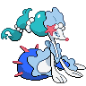
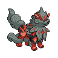

# 💥 Guía Competitiva de Pokémon - P2

## 💥 Guía Competitiva de Pokémon: Segunda Parte

El propósito de esta parte de la wiki es proporcionar una lista visual organizada por roles para ver qué Pokémon cumplen con cada función. Esto ayudará tanto a los jugadores nuevos como a los experimentados a encontrar Pokémon que se ajusten a sus equipos al buscar roles específicos. Cada Pokémon que esté aquí es viable en el metajuego VGC REG H, El orden de los roles se organizará de la siguiente manera:

* Offensive roles
* Supportive roles

La mayoria de los roles estan en inglés para buscarlos de una mejor manera (algunos de estos pokes pueden ser inusables en Pixelmon actualmente hasta que se les agregue ataques y tambien pueden a llegar ser removidos de su tier).

Antes de empezar, es importante entender que en VGC los combates son mucho más cortos, con un promedio de 8 a 12 turnos.

## Offensive roles

### Choice Band

  

### Choice Specs

 

### Choice Scarf

  

### Trick Room Sweepers

  

### Setup Sweepers

  

### Rain Abusers

 

### Sun Abusers

## Supportive

### Redirection

  

### Weather Setters

 

### Terrain Setters

 

### Trick room

 

### Tailwind

 

### Fake Out

 

### intimidate

 

### Sleep

### Haze / Clear Smog

  

## TEAMS

A continuacion aqui hay un buen core para empezar a crear un team propio si se quiere https://pokepast.es/ed588be4274011fc

si prefiere jugar algo ya armado completamente este es un buen team https://pokepast.es/ba91b0aa57470f98
