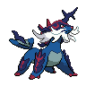
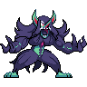
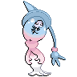
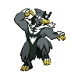
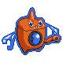

# 💥 Guía Competitiva de Pokémon: Primera Parte

El propósito de esta parte  de la wiki  es proporcionar una lista visual organizada por roles para ver qué Pokémon cumplen con cada función. Esto ayudará tanto a los jugadores nuevos como a los experimentados a encontrar Pokémon que se ajusten a sus equipos al buscar roles específicos. Cada Pokémon que esté aquí es viable en el metajuego OU, y como tal, cambiará a medida que se actualicen los rankings de viabilidad. El orden de los roles se organizará de la siguiente manera:

- Utility (meten cosas como púas y las remueven)
- Offensive roles (wallbreakers pivotes)
- Defensive roles (muros)
- Clima (lluvia y sol) y Trick Room

La mayoria de los roles estan en inglés para buscarlos de una mejor manera (algunos de estos pokes pueden ser inusables en Pixelmon actualmente hasta que se les agregue ataques y tambien pueden a llegar ser removidos de su tier).

# Utility

Entry Hazards

**- Ceaseless Edge -**

**- Stealth Rock -**

 

**- Spikes -**

  

**- Toxic Spikes -**

  

**- Hazard Setters -**

**- Screen Setters -**
 
 

**- Hazard Control -**

**- Magic Bounce -**

**- Toxic -**

 

# Offensive Roles

Wallbreakers

**- Physical -** 

 

**- Special -** 

  

**- Mixed -** 

Priority 

**- Aqua Jet -**

 

**- Extreme speed -**

Pivoting-

**- U-turn -**

   

**- Volt Switch -**

 

# Defensive Roles

Walls

**- Physically Defensive -**

     

**- Specially Defensive -**

    

**- Mixed -**
    

# Weather and Trick Room

**- Drizzle -** 

**- Swift Swim -**

  

**- Abusers -**

Trick Room

**- Setters -**

  

**- Abusers -**

Esto es una pequeña lista de los roles que hay en pokemon hay  muchos mas y con muchas mas diferentes estrategias si no esta aqui no es que el pokemon sea malo.

En esta playlist pueden ver otro monton de cosas mucho mas detallado (es bastante vieja)



### TEAM BUILDING
 
Ahora que ya entendemos los roles de cada Pokémon, podemos usarlos para formar un equipo. En el siguiente enlace, puedes ver un equipo básico que hemos diseñado:

Equipo Básico: [https://pokepast.es/9da62adc2f9bcda5](https://pokepast.es/9da62adc2f9bcda5)

En este equipo, cada Pokémon cumple un rol específico:

Clodsire: Actúa como Hazard Setter (colocador de trampas) y como muro especial.

Tapu Koko: Funciona como Special Sweeper (barredor especial).

Corviknight: Sirve como otro muro defensivo y se encarga de eliminar las trampas 

Rotom: Desempeña el rol de Bulky Pivot (pivote resistente).

Urshifu y Dragonite: Son Physical Sweepers (barredores físicos) con movimientos de prioridad.

Este equipo está diseñado para cubrir varias necesidades estratégicas y ofrecer una buena combinación de roles en combate.
